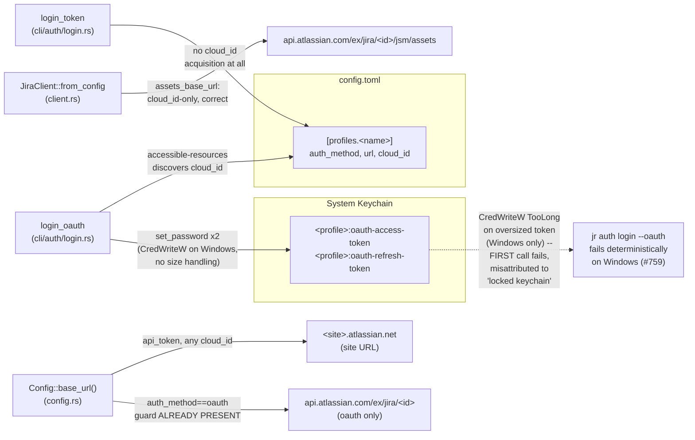
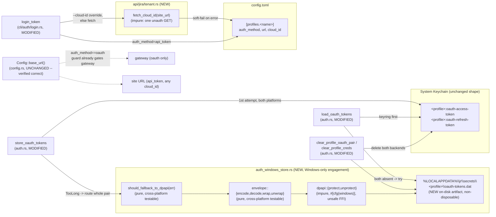
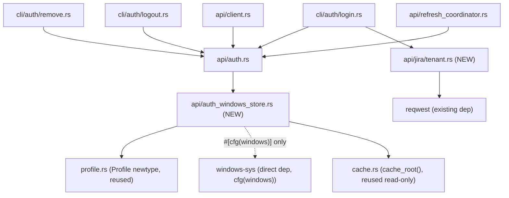

# Architecture Delta — Windows Correctness (`windows-correctness`, cycle-004)

This document covers the concrete architectural shape for cycle-004's `windows-correctness`
bundle (issues #759, #760; DEC-334; A-PA-LOW-001). It is structured as a delta: only what
changes from today's architecture is described. The decisions themselves — rationale,
alternatives, consequences — live in `ADR-0021-windows-oauth-secret-storage-dpapi-fallback.md`
and `ADR-0022-api-token-cloud-id-acquisition-tenant-info.md`; this document gives the "how,"
concrete enough for the product-owner's parallel F2 BC-authoring pass and for the formal-
verifier's VP-authoring pass to proceed without re-deriving the design.

No `src/` file has been touched by this document. All code shapes below are TARGET design, not
current state, unless explicitly marked "Current."

**Feature type: backend + infrastructure.** No UI surface (`jr` is CLI-only). `dtu_required:
false` — DPAPI is a Windows OS API (syscall FFI, not a network service to twin), and
`/_edge/tenant_info` is an existing-vendor (Atlassian) endpoint the codebase already integrates
with elsewhere (`accessible-resources`, GraphQL org discovery) — neither is a new third-party
service dependency requiring DTU fidelity assessment. `gene_transfusion_required: false` — no
proven reference implementation is being translated; both changes are original, small,
codebase-native designs.

---

## 1. Component / Data-Flow Overview

### 1.1 Current State (baseline, 42e92b46)

**Current problems this cycle fixes:**
1. `store_oauth_tokens` has no size-aware routing at all — the first oversized `set_password`
   on Windows fails with `keyring::Error::TooLong`, misreported as "Unlock your keychain."
2. `login_token` never acquires `cloud_id` — Assets/CMDB permanently fails on every API-token
   profile, a gap #759's fix widens by pushing more Windows users onto this path.
3. (Verified, NOT a problem) `Config::base_url()`'s `auth_method == "oauth"` gateway guard and
   `assets_base_url`'s cloud_id-only computation are both **already correct** — see §4.

### 1.2 Target State (this cycle)

---

## 2. New Modules

### 2.1 `src/api/auth_windows_store.rs` (NEW)

Sibling module to `src/api/auth.rs`, following the same "thin sibling module" pattern already
established by `src/api/auth_embedded.rs`. Subsystem: **SS-03** (HTTP Client Core — this
module's Primary Source Files list gains this file).

**Public/`pub(crate)` interface** (see ADR-0021 §3 for full signatures and doc comments):

| Item | Visibility | Purity | Cross-platform behavior |
|------|-----------|--------|--------------------------|
| `envelope::encode(access, refresh) -> Vec<u8>` | `pub(crate)` | **Pure** | Identical on all platforms |
| `envelope::decode(bytes) -> Result<(String,String)>` | `pub(crate)` | **Pure** | Identical on all platforms |
| `envelope::wrap(protected) -> Vec<u8>` | `pub(crate)` | **Pure** | Identical on all platforms |
| `envelope::unwrap(file_bytes) -> Result<&[u8]>` | `pub(crate)` | **Pure** | Identical on all platforms |
| `should_fallback_to_dpapi(err: &keyring::Error) -> bool` | `pub(crate)` | **Pure** | Identical on all platforms |
| `store_pair(profile, access, refresh) -> Result<()>` | `pub` | **Impure** (I/O + syscall) | `#[cfg(windows)]`: real DPAPI + atomic file write. `#[cfg(not(windows))]`: always returns the honest-fail `DpapiFallbackFailed` error immediately — no file I/O attempted. |
| `load_pair(profile) -> Result<Option<(String,String)>>` | `pub` | **Impure** (I/O + syscall) | `#[cfg(windows)]`: real file read + DPAPI unprotect. `#[cfg(not(windows))]`: always `Ok(None)` — no file I/O attempted. |
| `remove_if_present(profile) -> Result<()>` | `pub` | **Impure** (I/O) | `#[cfg(windows)]`: real delete, `NotFound`-tolerant. `#[cfg(not(windows))]`: always `Ok(())` immediately. |
| `dpapi::protect(plaintext) -> io::Result<Vec<u8>>` | private, `#[cfg(windows)]` | **Impure** (unsafe FFI) | Windows-only; does not exist in a non-Windows compilation unit at all. |
| `dpapi::unprotect(blob) -> io::Result<Vec<u8>>` | private, `#[cfg(windows)]` | **Impure** (unsafe FFI) | Windows-only; does not exist in a non-Windows compilation unit at all. |
| `DpapiFallbackFailed(String)` marker error | `pub(crate)` | n/a (data) | Identical on all platforms |

**Wiring to existing callers** (all in `src/api/auth.rs`):
- `store_oauth_tokens` — modified per ADR-0021 §2 (backend-selection-level routing + rollback).
- `load_oauth_tokens` — modified per ADR-0021 §4 (DPAPI-file fallback branch inserted before
  the existing `"default"`-only legacy recovery).
- `clear_profile_oauth_pair`, `clear_profile_creds` — each gains one
  `auth_windows_store::remove_if_present(profile)` call (ADR-0021 §7).
- `oauth_login`'s and `refresh_oauth_token_with_url`'s `store_oauth_tokens` `map_err` closures —
  branch on `e.downcast_ref::<auth_windows_store::DpapiFallbackFailed>()` (ADR-0021 §6).

No other file needs to know this module exists — every existing call site of
`store_oauth_tokens`/`load_oauth_tokens`/`clear_profile_*` (F1 §5.3: `refresh_coordinator.rs`,
`cli/auth/{login,refresh,logout,remove,status}.rs`, `client.rs`) is unaffected by signature —
only by behavior, and only in the oversized-secret case that previously crashed on Windows.

### 2.2 `src/api/jira/tenant.rs` (NEW)

New file in the existing `src/api/jira/` product-namespaced directory. Subsystem: **SS-04**
(Jira API Resources — already covers this directory generically; no Subsystem Registry text
change needed).

**Public interface** (see ADR-0022 §1 for the full implementation):

| Item | Visibility | Purity | Notes |
|------|-----------|--------|-------|
| `fetch_cloud_id(site_url: &str) -> Result<String>` | `pub` | **Impure** (network I/O) | Plain `reqwest` call, NOT routed through `JiraClient` (mirrors `oauth_login`'s direct `accessible-resources` call — no authenticated client exists yet at login time). |

**Wiring to existing callers:**
- `src/cli/auth/login.rs::login_token` — gains a `cloud_id_override: Option<&str>` parameter
  (mirroring `login_oauth`'s existing parameter of the same name) and calls `fetch_cloud_id`
  when no override is supplied, per the fallback chain in ADR-0022 §2.
- `src/cli/auth/login.rs::handle_login` — passes `args.cloud_id.as_deref()` through to
  `login_token` (currently dropped on the API-token branch — this is the concrete one-line
  dispatch fix).
- `src/cli/init.rs` (API-token branch) — must call the same `login_token`/`fetch_cloud_id`
  plumbing, not a second independent tenant_info call site (ADR-0022 §2). Exact `init.rs`
  wiring is an F3/F4 story-authoring detail.

---

## 3. Modified Components

| Component | File : Symbol | Change | Governing ADR |
|-----------|---------------|--------|----------------|
| `store_oauth_tokens` | `src/api/auth.rs` | Backend-selection-level routing on `keyring::Error::TooLong`; rollback of a partial keyring write; delegates to `auth_windows_store::store_pair` | ADR-0021 §2 |
| `load_oauth_tokens` | `src/api/auth.rs` | New DPAPI-file-fallback branch when both namespaced keyring keys are absent; extended (not replaced) partial-state handling | ADR-0021 §4 |
| `clear_profile_oauth_pair` | `src/api/auth.rs` | Additional `auth_windows_store::remove_if_present` call | ADR-0021 §7 |
| `clear_profile_creds` | `src/api/auth.rs` | Additional `auth_windows_store::remove_if_present` call | ADR-0021 §7 |
| `clear_all_credentials` (test-only) | `src/api/auth.rs` | Test-fixture parity update only — no behavior/production-callers change (F1 §5.2 row 5) | ADR-0021 (incidental) |
| `oauth_login`'s store-failure `map_err` | `src/api/auth.rs` | Branches on `DpapiFallbackFailed` marker; new honest-fail message on that arm only | ADR-0021 §6 |
| `refresh_oauth_token_with_url`'s post-refresh store-failure `map_err` | `src/api/auth.rs` | Same branch shape as above | ADR-0021 §6 |
| `refresh_oauth_token_with_url`'s read-failure branch | `src/api/auth.rs` | No message change; becomes DPAPI-aware transitively via the corrected `load_oauth_tokens` | ADR-0021 §6 |
| `login_token` | `src/cli/auth/login.rs` | New `cloud_id_override` parameter; calls `fetch_cloud_id` per the fallback chain; soft-fail on failure | ADR-0022 §2 |
| `handle_login` | `src/cli/auth/login.rs` | Passes `args.cloud_id.as_deref()` to `login_token` (currently dropped) | ADR-0022 §2 |
| `Cargo.toml` | root | New `[target.'cfg(windows)'.dependencies]` section: `windows-sys` (direct, `Win32_Security_Cryptography` + `Win32_Foundation` features) | ADR-0021 §5 |
| `deny.toml` | root | `reason` field of the existing `windows-sys` version `"0.60"` `[[bans.skip]]` entry updated to name `jr`'s own DPAPI usage alongside keyring's `windows-native` feature | ADR-0021 §5 |

## 4. Confirmed-Unchanged (verified during this F2 pass, not re-implemented)

- **`Config::base_url()`** (`src/config.rs`) already gates the OAuth gateway URL
  (`https://api.atlassian.com/ex/jira/{cloud_id}`) behind `profile.auth_method.as_deref() ==
  Some("oauth")`; any other `auth_method` — including `api_token` and an unset `auth_method`
  (which `JiraClient::from_config` defaults to `api_token` via `.unwrap_or("api_token")`) —
  falls through to the site URL regardless of whether `cloud_id` is present. This is the guard
  research Question E ("A-PA-LOW-001") recommends; it already exists. **No change.**
- **`JiraClient::from_config`'s `assets_base_url` computation** (`src/api/client.rs`) derives
  the Assets/CMDB gateway URL from `profile.cloud_id` alone, with no `auth_method` gate. This is
  correct as-is: Assets genuinely reaches `api.atlassian.com/ex/jira/{cloudId}/jsm/assets/...`
  under Basic auth too (research Question E). **No change.**

Both confirmations are documented explicitly in ADR-0022 §4 so a future pass does not
mistakenly "fix" either a second time.

---

## 5. Dependency Graph Impact

**Acyclicity check:** `auth_windows_store.rs` depends only on `cache.rs` (read-only reuse of
`cache_root()`) and `profile.rs` (the `Profile` newtype) — both already-leaf-ward modules
relative to `auth.rs` in the existing graph (`auth.rs` already depends on both). `auth.rs`
gains a new outgoing edge to `auth_windows_store.rs`; `auth_windows_store.rs` has **no** edge
back to `auth.rs`. `api/jira/tenant.rs` depends only on `reqwest` (external) — no edge to
`auth.rs`, `config.rs`, or any other `api/jira/` sibling. `cli/auth/login.rs` gains one new
outgoing edge to `api/jira/tenant.rs`, consistent with its existing role as the orchestration
layer that already depends on `api/auth.rs`, `config.rs`, and other `api/` modules. **No new
cycle is introduced; the graph remains acyclic.**

---

## 6. Purity Boundary Map Update

| Module / Function | Classification | Notes |
|---|---|---|
| `auth_windows_store::envelope::{encode,decode,wrap,unwrap}` | **Pure Core** | Deterministic byte transforms; no I/O, no syscalls. Unit-testable on any OS/CI runner. |
| `auth_windows_store::should_fallback_to_dpapi` | **Pure Core** | Deterministic predicate over a `keyring::Error` value. Unit-testable on any OS/CI runner. |
| `auth_windows_store::store_pair` / `load_pair` / `remove_if_present` | **Effectful Shell** | File I/O + (on Windows) DPAPI syscalls. The `#[cfg(not(windows))]` arms are still "effectful" by classification (they are the boundary functions), even though they perform no actual I/O — the classification follows the function's role, not whether a given cfg-arm happens to touch disk. |
| `auth_windows_store::dpapi::{protect,unprotect}` | **Effectful Shell** (`unsafe`) | Windows-only FFI. The sole `unsafe` code in this module tree; two functions, unit-testable only via real `CryptProtectData`/`CryptUnprotectData` round-trips (Windows CI or manual, per F1 §10). |
| `api/jira/tenant::fetch_cloud_id` | **Effectful Shell** | Network I/O (`reqwest`). No pure sub-component to extract — the entire function is "make one HTTP call, parse one field." |
| `store_oauth_tokens` / `load_oauth_tokens` (post-change) | **Effectful Shell** (unchanged classification) | Already effectful (keychain I/O) before this cycle; the new DPAPI-routing logic they call out to is itself split pure/impure per the rows above, but the calling functions remain shell-classified as a whole. |
| `login_token` (post-change) | **Effectful Shell** (unchanged classification) | Already effectful (keychain + config I/O); gains one more effectful call (`fetch_cloud_id`). |

This split directly answers the F1 §10 Windows-only-testability risk: the routing DECISION
(`should_fallback_to_dpapi`) and the envelope FORMAT (`encode`/`decode`/`wrap`/`unwrap`) are
fully covered by ordinary `cargo test` on macOS/Linux CI; only the two-function DPAPI FFI
wrapper and a genuine end-to-end `jr auth login --oauth` round-trip require Windows CI or
manual validation.

---

## 7. Verification-Property Hooks (for the formal-verifier's F2 pass)

Carried forward from F1 §7.4, now targeted at the concrete modules above — the formal-verifier
owns drafting the actual VP-NNN documents; this section only pins target module + tool:

| VP (F1-provisional ID) | Target | Tool | Platform |
|---|---|---|---|
| VP-AUTHDX-010 | `auth_windows_store::dpapi::{protect,unprotect}` round-trip | Manual / Windows CI integration test | Windows-only |
| VP-AUTHDX-011 | `store_oauth_tokens`'s `TooLong` routing (§2 of ADR-0021) | proptest / unit test (mocked `keyring::Error`) | Cross-platform |
| VP-AUTHDX-012 | Atomic dual-write invariant (rollback-on-partial-overflow, ADR-0021 §2) | Unit test with a fault-injection seam (mirrors the existing `JR_S303_PERSIST_FAIL` pattern) | Cross-platform (logic); Windows CI for the real file-rename step |
| VP-AUTHDX-013 | Cross-platform non-engagement of `#[cfg(windows)] mod dpapi` | Compile-time (`cfg`-gated absence), not a runtime test | Cross-platform (proves absence on non-Windows) |
| (new, unnumbered — formal-verifier to allocate) | `api/jira/tenant::fetch_cloud_id` — soft-fail on non-2xx/network error/malformed JSON | Unit test with `wiremock` | Cross-platform |
| (new, unnumbered — formal-verifier to allocate) | `login_token`'s `cloud_id` refresh-not-clear behavior on a mechanism switch (ADR-0022 §3) | Integration test extending `tests/auth_chosen_flow_reconcile.rs` | Cross-platform |

---

## 8. Regression Baseline (unaffected by this cycle, confirm at F7)

Unchanged from F1 §9's "explicitly NOT changed" list: `src/api/auth_embedded.rs`,
`src/profile.rs`, all non-auth CLI command families, every `types/`/`adf.rs`/`jql.rs`/
`duration.rs`/`observability.rs`/`output.rs` module. Additionally confirmed unchanged by this
delta (§4): `Config::base_url()`'s gateway guard, `JiraClient::from_config`'s `assets_base_url`
computation.

---

## 9. Residual Design Questions Flagged for Product-Owner / Formal-Verifier / F2 Gate

1. **Profile-name-as-filename trust boundary (new, this pass).** `Profile::from(String)`
   performs **no validation** (`src/profile.rs`, "Infallible by design," ADR-0011) — a profile
   name can be any string, including one containing path-traversal-unsafe characters. The
   existing `cache_dir(profile)` (`src/cache.rs`) already joins the raw profile string into a
   filesystem path with no sanitization, and this ADR's new `auth_windows_store::file_path`
   follows the identical, already-established convention (§3 of ADR-0021) rather than inventing
   a new, inconsistent sanitization rule for one call site. This is an INHERITED risk, not a
   NEW one introduced by this cycle — but it is now a location where a hostile profile name
   could conceivably write a *secret* file outside the intended directory, one step more
   sensitive than the existing cache-file precedent. Flagged for the formal-verifier to decide
   whether a defense-in-depth sanitization pass (mirroring `sanitize_attachment_filename`'s
   CWE-22 discipline) is warranted as a stretch goal in this cycle or a tracked follow-up —
   profile names are operator-controlled local config, not remote-attacker-controlled input, so
   this is a hardening opportunity, not a blocking defect.
2. **`jr init`'s exact API-token wiring** (ADR-0022 §2) is intentionally left to F3/F4
   story-authoring rather than specified line-by-line here, since `init.rs` was not read in
   full during this pass — only its existing call-through-to-`login_token` relationship
   (documented in ADR-0020's Context) was confirmed. The product-owner/story-writer should
   verify `init.rs`'s API-token branch actually calls `login_token` (not a separate, parallel
   credential-write path) before assuming this ADR's fix reaches it for free.
3. **Windows-only testability / manual validation gate** (carried forward from F1 §10,
   unresolved by this architecture pass by design — it is a process question, not a design
   one): is a manual smoke test on real Windows an acceptable, available F7 gate, or does F4
   need to first spike whether `windows-latest` GitHub Actions CI can exercise
   `CryptProtectData` end-to-end? This materially affects how much of ADR-0021's DPAPI logic
   gets CI coverage vs. manual-only coverage, and should be resolved before F4 commits to a
   story estimate.
4. **BC/EC allocation for the mechanism-switch refresh behavior** (ADR-0022 §3): the fix has no
   dedicated code branch (it falls out of `login_token`'s general behavior), so it is easy to
   under-specify at the BC layer. The product-owner's BC-authoring pass should write an explicit
   BC/EC pair for "oauth→api_token switch refreshes cloud_id on success, preserves the prior
   value on fetch failure" so it gets its own test, not just incidental coverage from
   `login_token`'s general-case tests.
</content>
