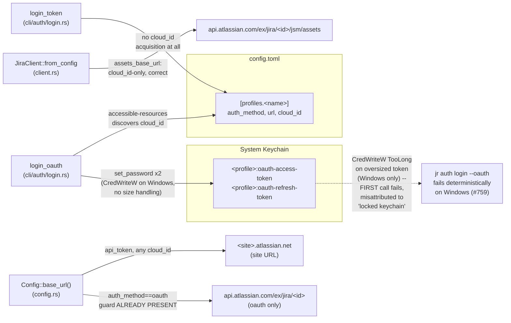
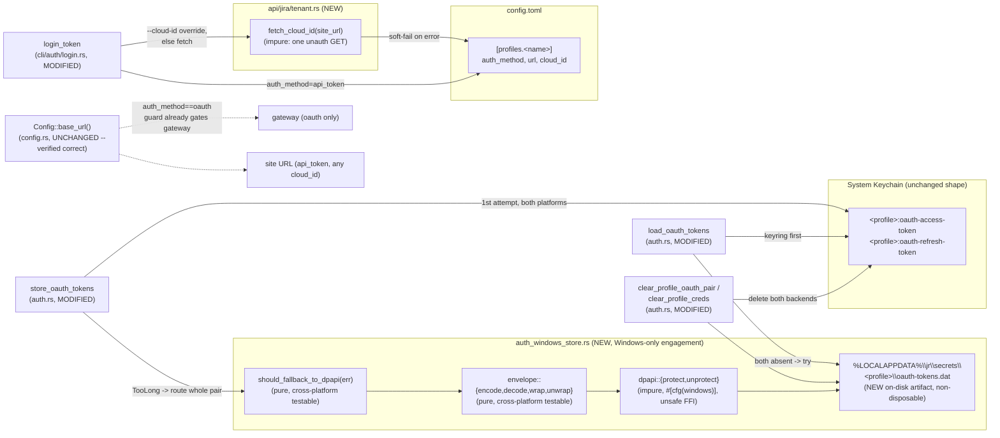
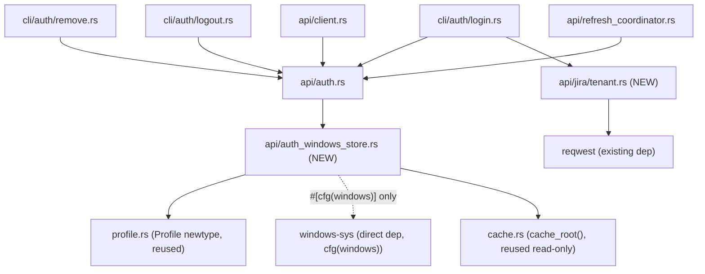

# Architecture Delta — Windows Correctness (`windows-correctness`, cycle-004)

This document covers the concrete architectural shape for cycle-004's `windows-correctness`
bundle (issues #759, #760; DEC-334; A-PA-LOW-001). It is structured as a delta: only what
changes from today's architecture is described. The decisions themselves — rationale,
alternatives, consequences — live in `ADR-0021-windows-oauth-secret-storage-dpapi-fallback.md`
and `ADR-0022-api-token-cloud-id-acquisition-tenant-info.md`; this document gives the "how,"
concrete enough for the product-owner's parallel F2 BC-authoring pass and for the formal-
verifier's VP-authoring pass to proceed without re-deriving the design.

No `src/` file has been touched by this document. All code shapes below are TARGET design, not
current state, unless explicitly marked "Current."

**Feature type: backend + infrastructure.** No UI surface (`jr` is CLI-only). `dtu_required:
false` — DPAPI is a Windows OS API (syscall FFI, not a network service to twin), and
`/_edge/tenant_info` is an existing-vendor (Atlassian) endpoint the codebase already integrates
with elsewhere (`accessible-resources`, GraphQL org discovery) — neither is a new third-party
service dependency requiring DTU fidelity assessment. `gene_transfusion_required: false` — no
proven reference implementation is being translated; both changes are original, small,
codebase-native designs.

---

## 1. Component / Data-Flow Overview

### 1.1 Current State (baseline, 42e92b46)

**Current problems this cycle fixes:**
1. `store_oauth_tokens` has no size-aware routing at all — the first oversized `set_password`
   on Windows fails with `keyring::Error::TooLong`, misreported as "Unlock your keychain."
2. `login_token` never acquires `cloud_id` — Assets/CMDB permanently fails on every API-token
   profile, a gap #759's fix widens by pushing more Windows users onto this path.
3. (Verified, NOT a problem) `Config::base_url()`'s `auth_method == "oauth"` gateway guard and
   `assets_base_url`'s cloud_id-only computation are both **already correct** — see §4.

### 1.2 Target State (this cycle)

---

## 2. New Modules

### 2.1 `src/api/auth_windows_store.rs` (NEW)

Sibling module to `src/api/auth.rs`, following the same "thin sibling module" pattern already
established by `src/api/auth_embedded.rs`. Subsystem: **SS-03** (HTTP Client Core — this
module's Primary Source Files list gains this file).

**Anchor justification (verified against ARCH-INDEX.md, Pass-2 review Finding #9).** SS-03's own
Subsystem Registry entry (`ARCH-INDEX.md`) already lists `src/api/auth.rs` and
`src/api/auth_embedded.rs` as SS-03 member files — neither does any HTTP itself (`auth_embedded.rs`
is XOR-obfuscated embedded-credential plumbing with zero network calls; `auth.rs`'s keychain/DPAPI
code is not HTTP either). SS-03's registry description ("HTTP Client Core") is therefore broader
in practice than its label: it is this codebase's auth-and-HTTP-client-infrastructure subsystem,
not literally "code that makes HTTP requests." `auth_windows_store.rs` belongs to SS-03 for the
same reason `auth_embedded.rs` does — it is a thin sibling module extending `auth.rs`'s
credential-storage responsibility, not because it performs HTTP I/O (it performs none: DPAPI
syscalls and local file I/O only). This is a consistent placement, not a mis-anchor; no change to
the Subsystem Registry or to this module's anchor is needed.

**Public/`pub(crate)` interface** (see ADR-0021 §3 for full signatures and doc comments):

| Item | Visibility | Purity | Cross-platform behavior |
|------|-----------|--------|--------------------------|
| `envelope::encode(access, refresh) -> Vec<u8>` | `pub(crate)` | **Pure** | Identical on all platforms |
| `envelope::decode(bytes) -> Result<(String,String)>` | `pub(crate)` | **Pure** | Identical on all platforms |
| `envelope::wrap(protected) -> Vec<u8>` | `pub(crate)` | **Pure** | Identical on all platforms |
| `envelope::unwrap(file_bytes) -> Result<&[u8]>` | `pub(crate)` | **Pure** | Identical on all platforms |
| `should_fallback_to_dpapi(err: &keyring::Error) -> bool` | `pub(crate)` | **Pure** | Identical on all platforms |
| `engage_dpapi_fallback(err: &keyring::Error) -> bool` (in `auth.rs`, NOT `auth_windows_store.rs`) | private | **Pure** | `#[cfg(windows)]`: delegates to `should_fallback_to_dpapi`. `#[cfg(not(windows))]`: always `false` — call-site gate closing Finding #5 (Pass-1 review); `store_oauth_tokens`'s match guards call this, never `should_fallback_to_dpapi` directly, so `DpapiFallbackFailed` can never be produced on non-Windows. |
| `store_pair(profile, access, refresh) -> Result<()>` | `pub` | **Impure** (I/O + syscall) | Guard (`reject_unsafe_profile_component`, via `file_path`) is invoked FIRST on BOTH cfg arms (Pass-4 review, Finding #2). `#[cfg(windows)]`: guard, then real DPAPI + atomic file write. `#[cfg(not(windows))]`: guard, then always returns the honest-fail `DpapiFallbackFailed` error immediately — no file I/O attempted. |
| `load_pair(profile) -> Result<Option<(String,String)>>` | `pub` | **Impure** (I/O + syscall) | Guard invoked FIRST on BOTH cfg arms (Pass-4 review, Finding #2). `#[cfg(windows)]`: guard, then real file read + DPAPI unprotect. `#[cfg(not(windows))]`: guard, then always `Ok(None)` — no file I/O attempted. |
| `remove_if_present(profile) -> Result<()>` | `pub` | **Impure** (I/O) | Guard invoked FIRST on BOTH cfg arms (Pass-4 review, Finding #2). `#[cfg(windows)]`: guard, then real delete, `NotFound`-tolerant. `#[cfg(not(windows))]`: guard, then always `Ok(())` immediately. |
| `dpapi::protect(plaintext) -> io::Result<Vec<u8>>` | private, `#[cfg(windows)]` | **Impure** (unsafe FFI) | Windows-only; does not exist in a non-Windows compilation unit at all. |
| `dpapi::unprotect(blob) -> io::Result<Vec<u8>>` | private, `#[cfg(windows)]` | **Impure** (unsafe FFI) | Windows-only; does not exist in a non-Windows compilation unit at all. |
| `DpapiFallbackFailed(String)` marker error | `pub(crate)` | n/a (data) | Identical on all platforms |
| `reject_unsafe_profile_component(profile) -> Result<(), ProfilePathEscape>` (Pass-2 review Finding #1, ADR-0021 §9) | `pub(crate)` | **Pure** | Host-independent Windows-syntax recognizer — NOT `std::path` — so behavior is identical regardless of the OS `cargo test` runs on; the sole call site is `file_path`, invoked first by all three of `store_pair`/`load_pair`/`remove_if_present`, on BOTH their cfg arms (Pass-4 review, Finding #2 — the guard call is not merely conceptually first, it is a mandatory first statement in every cfg-gated function body, so its wiring is regression-catchable on default Linux/macOS CI). Reserved-device-name recognition extended (Pass-4 review, Finding #3) to include the Unicode superscript-digit `COM`/`LPT` variants and leading-space-trimmed stem matching — final set is 30 names, see ADR-0021 §9. |
| `ProfilePathEscape` marker error (Pass-2 review Finding #1, ADR-0021 §9) | `pub(crate)` | n/a (data) | Identical on all platforms |
| `CorruptSecretFile(String)` marker error (Pass-2 review Finding #2, ADR-0021 §3) | `pub(crate)` | n/a (data) | Identical on all platforms; distinguishes a corrupt/undecryptable `load_pair` result from a genuine backend/IO error, mirroring `DpapiFallbackFailed`'s discrimination pattern. |

**Wiring to existing callers** (all in `src/api/auth.rs`):
- `store_oauth_tokens` — modified per ADR-0021 §2 (backend-selection-level routing + rollback).
- `load_oauth_tokens` — modified per ADR-0021 §4 (DPAPI-file fallback branch inserted before
  the existing `"default"`-only legacy recovery).
- `clear_profile_oauth_pair`, `clear_profile_creds` — each gains one
  `auth_windows_store::remove_if_present(profile)` call (ADR-0021 §7).
- `oauth_login`'s and `refresh_oauth_token_with_url`'s `store_oauth_tokens` `map_err` closures —
  branch on `e.downcast_ref::<auth_windows_store::DpapiFallbackFailed>()` (ADR-0021 §6).
- `load_oauth_tokens`'s new DPAPI-fallback-read branch — branches on
  `e.downcast_ref::<auth_windows_store::CorruptSecretFile>()` to select the force-re-login
  message vs. the distinct backend/IO-error message (ADR-0021 §3/§4, Pass-2 review Finding #2).
- Whichever call site first surfaces a `ProfilePathEscape` to the user — maps it to
  `JrError::UserError` (exit 64) via the same downcast convention, a new branch alongside the
  `DpapiFallbackFailed` one (ADR-0021 §9, Pass-2 review Finding #1; exact call site is F4 scope).

No other file needs to know this module exists — every existing call site of
`store_oauth_tokens`/`load_oauth_tokens`/`clear_profile_*` (F1 §5.3: `refresh_coordinator.rs`,
`cli/auth/{login,refresh,logout,remove,status}.rs`, `client.rs`) is unaffected by signature —
only by behavior, and only in the oversized-secret case that previously crashed on Windows.

### 2.2 `src/api/jira/tenant.rs` (NEW)

New file in the existing `src/api/jira/` product-namespaced directory. Subsystem: **SS-04**
(Jira API Resources — already covers this directory generically; no Subsystem Registry text
change needed).

**Public interface** (see ADR-0022 §1 for the full implementation):

| Item | Visibility | Purity | Notes |
|------|-----------|--------|-------|
| `fetch_cloud_id(site_url: &str) -> Result<String>` | `pub` | **Impure** (network I/O) | Plain `reqwest` call, NOT routed through `JiraClient` (mirrors `oauth_login`'s direct `accessible-resources` call — no authenticated client exists yet at login time). Client is built with `redirect::Policy::none()` (Finding #12, Pass-1 review) — a 3xx response is treated as a plain non-2xx failure, never followed cross-host. Does not share `JiraClient`'s proxy/CA config (Finding #14, accepted — see ADR-0022 §1). Requires `site_url` to start with `https://` (case-insensitive) — an `http://` or scheme-less site skips the fetch entirely with no network call, soft-failing identically to any other fetch failure (Finding #4, Pass-4 review — see ADR-0022 §1). |

**Wiring to existing callers:**
- `src/cli/auth/login.rs::login_token` — gains a `cloud_id_override: Option<&str>` parameter
  (mirroring `login_oauth`'s existing parameter of the same name) and calls `fetch_cloud_id`
  when no override is supplied, per the fallback chain in ADR-0022 §2.
- `src/cli/auth/login.rs::handle_login` — passes `args.cloud_id.as_deref()` through to
  `login_token` (currently dropped on the API-token branch — this is the concrete one-line
  dispatch fix).
- `src/cli/auth/refresh.rs::refresh_credentials` (Pass-3 adversarial review, Finding #2) — a
  SECOND, previously-unlisted direct `login_token` caller; the new parameter makes this a
  compile-forcing change here too. Updated call: `login_token(&target, args.email, args.token,
  None, args.no_input).await` — `None` hardcoded (no `RefreshArgs.cloud_id` field, no
  `--cloud-id` support added), mirroring the identical `None` already hardcoded on this
  function's sibling `login_oauth` call. Consequence: `jr auth refresh` on an api_token profile
  now performs the tenant_info fetch on every invocation — see ADR-0022 §2's "Decision" note for
  why this is intentional, not a gap.
- `src/cli/init.rs` (API-token branch) — must call the same `login_token`/`fetch_cloud_id`
  plumbing, not a second independent tenant_info call site (ADR-0022 §2). Exact `init.rs`
  wiring is an F3/F4 story-authoring detail.

---

## 3. Modified Components

| Component | File : Symbol | Change | Governing ADR |
|-----------|---------------|--------|----------------|
| `store_oauth_tokens` | `src/api/auth.rs` | Backend-selection-level routing on `keyring::Error::TooLong`; rollback of a partial keyring write; delegates to `auth_windows_store::store_pair` | ADR-0021 §2 |
| `load_oauth_tokens` | `src/api/auth.rs` | New DPAPI-file-fallback branch when both namespaced keyring keys are absent; extended (not replaced) partial-state handling | ADR-0021 §4 |
| `clear_profile_oauth_pair` | `src/api/auth.rs` | Additional `auth_windows_store::remove_if_present` call | ADR-0021 §7 |
| `clear_profile_creds` | `src/api/auth.rs` | Additional `auth_windows_store::remove_if_present` call | ADR-0021 §7 |
| `clear_all_credentials` (test-only) | `src/api/auth.rs` | Test-fixture parity update only — no behavior/production-callers change (F1 §5.2 row 5) | ADR-0021 (incidental) |
| `oauth_login`'s store-failure `map_err` | `src/api/auth.rs` | Branches on `DpapiFallbackFailed` marker; new honest-fail message on that arm only | ADR-0021 §6 |
| `refresh_oauth_token_with_url`'s post-refresh store-failure `map_err` | `src/api/auth.rs` | Same branch shape as above | ADR-0021 §6 |
| `refresh_oauth_token_with_url`'s read-failure branch | `src/api/auth.rs` | No message change; becomes DPAPI-aware transitively via the corrected `load_oauth_tokens` | ADR-0021 §6 |
| `login_token` | `src/cli/auth/login.rs` | New `cloud_id_override` parameter; calls `fetch_cloud_id` per the fallback chain; soft-fail on failure | ADR-0022 §2 |
| `handle_login` | `src/cli/auth/login.rs` | Passes `args.cloud_id.as_deref()` to `login_token` (currently dropped) | ADR-0022 §2 |
| `refresh_credentials` | `src/cli/auth/refresh.rs` | Second, previously-unlisted `login_token` call site updated for the new parameter (hardcoded `None`, mirroring the sibling `login_oauth` call on the same function); `auth refresh` on an api_token profile now triggers the tenant_info fetch on every invocation (intentional — ADR-0022 §2 "Decision") | ADR-0022 §2 (Pass-3 Finding #2) |
| `Cargo.toml` | root | New `[target.'cfg(windows)'.dependencies]` section: `windows-sys` (direct, `Win32_Security_Cryptography` + `Win32_Foundation` features) | ADR-0021 §5 |
| `deny.toml` | root | `reason` field of the existing `windows-sys` version `"0.60"` `[[bans.skip]]` entry updated to name `jr`'s own DPAPI usage alongside keyring's `windows-native` feature | ADR-0021 §5 |

## 4. Confirmed-Unchanged (verified during this F2 pass, not re-implemented)

- **`Config::base_url()`** (`src/config.rs`) already gates the OAuth gateway URL
  (`https://api.atlassian.com/ex/jira/{cloud_id}`) behind `profile.auth_method.as_deref() ==
  Some("oauth")`; any other `auth_method` — including `api_token` and an unset `auth_method`
  (which `JiraClient::from_config` defaults to `api_token` via `.unwrap_or("api_token")`) —
  falls through to the site URL regardless of whether `cloud_id` is present. This is the guard
  research Question E ("A-PA-LOW-001") recommends; it already exists. **No change.**
- **`JiraClient::from_config`'s `assets_base_url` computation** (`src/api/client.rs`) derives
  the Assets/CMDB gateway URL from `profile.cloud_id` alone, with no `auth_method` gate. This
  remains the architecturally correct shape — Assets has no site-URL alternative for its data
  calls — but **whether the gateway actually accepts `jr`'s classic-token Basic auth is
  unconfirmed** (Pass-1 review Finding #1: the research's supporting evidence, issue #185, is
  for a scoped token only; see ADR-0022 Context and Consequences). **No code change**, but do not
  read this row as confirming Assets succeeds for classic tokens — the guaranteed benefit of this
  cycle's fix is A-PA-LOW-001 closure (fresh/correct `cloud_id` persisted), not Assets success.

Both confirmations are documented explicitly in ADR-0022 §4 so a future pass does not
mistakenly "fix" either a second time.

---

## 5. Dependency Graph Impact

**Acyclicity check:** `auth_windows_store.rs` depends only on `cache.rs` (read-only reuse of
`cache_root()`) and `profile.rs` (the `Profile` newtype) — both already-leaf-ward modules
relative to `auth.rs` in the existing graph (`auth.rs` already depends on both). `auth.rs`
gains a new outgoing edge to `auth_windows_store.rs`; `auth_windows_store.rs` has **no** edge
back to `auth.rs`. `api/jira/tenant.rs` depends only on `reqwest` (external) — no edge to
`auth.rs`, `config.rs`, or any other `api/jira/` sibling. `cli/auth/login.rs` gains one new
outgoing edge to `api/jira/tenant.rs`, consistent with its existing role as the orchestration
layer that already depends on `api/auth.rs`, `config.rs`, and other `api/` modules. **No new
cycle is introduced; the graph remains acyclic.**

---

## 6. Purity Boundary Map Update

| Module / Function | Classification | Notes |
|---|---|---|
| `auth_windows_store::envelope::{encode,decode,wrap,unwrap}` | **Pure Core** | Deterministic byte transforms; no I/O, no syscalls. Unit-testable on any OS/CI runner. |
| `auth_windows_store::should_fallback_to_dpapi` | **Pure Core** | Deterministic predicate over a `keyring::Error` value. Unit-testable on any OS/CI runner. |
| `auth_windows_store::reject_unsafe_profile_component` | **Pure Core** | Host-independent character-level recognizer, not `std::path` (ADR-0021 §9, Pass-2 review Finding #1). Unit-testable on any OS/CI runner — including Windows-syntax vectors (drive letters, ADS colons, UNC prefixes) run from Linux/macOS CI, since the recognizer never delegates to the host's own path parser. |
| `auth_windows_store::store_pair` / `load_pair` / `remove_if_present` | **Effectful Shell** | File I/O + (on Windows) DPAPI syscalls. The `#[cfg(not(windows))]` arms are still "effectful" by classification (they are the boundary functions), even though they perform no actual I/O — the classification follows the function's role, not whether a given cfg-arm happens to touch disk. |
| `auth_windows_store::dpapi::{protect,unprotect}` | **Effectful Shell** (`unsafe`) | Windows-only FFI. The sole `unsafe` code in this module tree; two functions, unit-testable only via real `CryptProtectData`/`CryptUnprotectData` round-trips (Windows CI or manual, per F1 §10). |
| `api/jira/tenant::fetch_cloud_id` | **Effectful Shell** | Network I/O (`reqwest`). No pure sub-component to extract — the entire function is "make one HTTP call, parse one field." |
| `store_oauth_tokens` / `load_oauth_tokens` (post-change) | **Effectful Shell** (unchanged classification) | Already effectful (keychain I/O) before this cycle; the new DPAPI-routing logic they call out to is itself split pure/impure per the rows above, but the calling functions remain shell-classified as a whole. |
| `login_token` (post-change) | **Effectful Shell** (unchanged classification) | Already effectful (keychain + config I/O); gains one more effectful call (`fetch_cloud_id`). |

This split directly answers the F1 §10 Windows-only-testability risk: the routing DECISION
(`should_fallback_to_dpapi`) and the envelope FORMAT (`encode`/`decode`/`wrap`/`unwrap`) are
fully covered by ordinary `cargo test` on macOS/Linux CI; only the two-function DPAPI FFI
wrapper and a genuine end-to-end `jr auth login --oauth` round-trip require Windows CI or
manual validation.

---

## 7. Verification-Property Hooks (for the formal-verifier's F2 pass)

Carried forward from F1 §7.4, now targeted at the concrete modules above — the formal-verifier
owns drafting the actual VP-NNN documents; this section only pins target module + tool:

| VP (F1-provisional ID) | Target | Tool | Platform |
|---|---|---|---|
| VP-AUTHDX-010 | `auth_windows_store::dpapi::{protect,unprotect}` round-trip | Manual / Windows CI integration test | Windows-only |
| VP-AUTHDX-011 | `store_oauth_tokens`'s `TooLong` routing (§2 of ADR-0021) | proptest / unit test (mocked `keyring::Error`) | Cross-platform |
| VP-AUTHDX-012 | Atomic dual-write invariant (rollback-on-partial-overflow, ADR-0021 §2) | Unit test with a fault-injection seam (mirrors the existing `JR_S303_PERSIST_FAIL` pattern) | Cross-platform (logic); Windows CI for the real file-rename step |
| VP-AUTHDX-013 | Cross-platform non-engagement of `#[cfg(windows)] mod dpapi` | Compile-time (`cfg`-gated absence), not a runtime test | Cross-platform (proves absence on non-Windows) |
| (new, unnumbered — formal-verifier to allocate) | `api/jira/tenant::fetch_cloud_id` — soft-fail on non-2xx/network error/malformed JSON | Unit test with `wiremock` | Cross-platform |
| (new, unnumbered — formal-verifier to allocate) | `login_token`'s `cloud_id` refresh-not-clear behavior on a mechanism switch (ADR-0022 §3), AND `jr auth refresh`'s direct `login_token` call triggering the fetch on every invocation (ADR-0022 §2 "Decision", Pass-3 Finding #2) | Integration test extending `tests/auth_chosen_flow_reconcile.rs` | Cross-platform |
| (new, unnumbered — formal-verifier to allocate; Pass-3 Finding #1, STALE-KEYRING-SHADOWS-DPAPI) | `store_oauth_tokens`'s keyring-clear-before-DPAPI-store route (ADR-0021 §2): given a PRE-EXISTING complete keyring pair for a profile AND a fresh `access` write that returns `TooLong` (both the access-overflow arm and the refresh-overflow-after-access-succeeded arm), assert that after `store_oauth_tokens` returns `Ok`: (a) both namespaced keyring keys are absent, (b) the DPAPI file contains the fresh pair, and (c) a subsequent `load_oauth_tokens` returns the fresh DPAPI pair — never the stale keyring values | Unit test with a fault-injection seam producing `keyring::Error::TooLong` on a pre-seeded keyring pair | Cross-platform (logic/routing); Windows CI or manual for the real DPAPI write |

---

## 8. Regression Baseline (unaffected by this cycle, confirm at F7)

Unchanged from F1 §9's "explicitly NOT changed" list: `src/api/auth_embedded.rs`,
`src/profile.rs`, all non-auth CLI command families, every `types/`/`adf.rs`/`jql.rs`/
`duration.rs`/`observability.rs`/`output.rs` module. Additionally confirmed unchanged by this
delta (§4): `Config::base_url()`'s gateway guard, `JiraClient::from_config`'s `assets_base_url`
computation.

---

## 9. Residual Design Questions Flagged for Product-Owner / Formal-Verifier / F2 Gate

1. **Profile-name-as-filename trust boundary — RESOLVED this pass (Pass-2 adversarial review,
   Finding #1).** `Profile::from(String)` performs **no validation** (`src/profile.rs`,
   "Infallible by design," ADR-0011) — a profile name can be any string, including one
   containing path-traversal-unsafe characters. This item was originally flagged here as a
   hardening opportunity for the formal-verifier to decide on; the product-owner/formal-verifier
   subsequently committed it as BC-1.4.040/VP-AUTHDX-016 this same F2 pass, described only as a
   "Windows-syntax-aware" guard — ambiguous enough that a `std::path`-based implementation run on
   Linux CI would silently accept `"C:\\evil"`, `"\\\\server\\share"`, and `"name:$DATA"` as
   ordinary filenames (Pass-2 Finding #1). ADR-0021 §9 now mandates a concrete, host-independent
   recognizer (`reject_unsafe_profile_component`, never `std::path`) wired as the first statement
   of `file_path`, itself the sole call site reached by all three of `store_pair`/`load_pair`/
   `remove_if_present`. This guard is scoped to the NEW `auth_windows_store.rs` secrets path only
   — `cache_dir(profile)` (`src/cache.rs`)'s pre-existing, unguarded join for the
   lower-sensitivity, disposable cache namespace remains untouched and is still a separate,
   inherited (not new) risk, out of this cycle's scope. See the "Pass-2 architect guidance for
   product-owner and formal-verifier" section below for the required BC-1.4.040/VP-AUTHDX-016
   wording correction.
2. **`jr init`'s exact API-token wiring** (ADR-0022 §2) is intentionally left to F3/F4
   story-authoring rather than specified line-by-line here, since `init.rs` was not read in
   full during this pass — only its existing call-through-to-`login_token` relationship
   (documented in ADR-0020's Context) was confirmed. The product-owner/story-writer should
   verify `init.rs`'s API-token branch actually calls `login_token` (not a separate, parallel
   credential-write path) before assuming this ADR's fix reaches it for free.
3. **Windows-only testability / manual validation gate** (carried forward from F1 §10,
   unresolved by this architecture pass by design — it is a process question, not a design
   one): is a manual smoke test on real Windows an acceptable, available F7 gate, or does F4
   need to first spike whether `windows-latest` GitHub Actions CI can exercise
   `CryptProtectData` end-to-end? This materially affects how much of ADR-0021's DPAPI logic
   gets CI coverage vs. manual-only coverage, and should be resolved before F4 commits to a
   story estimate.
4. **BC/EC allocation for the mechanism-switch refresh behavior** (ADR-0022 §3): the fix has no
   dedicated code branch (it falls out of `login_token`'s general behavior), so it is easy to
   under-specify at the BC layer. The product-owner's BC-authoring pass should write an explicit
   BC/EC pair for "oauth→api_token switch refreshes cloud_id on success, preserves the prior
   value on fetch failure" so it gets its own test, not just incidental coverage from
   `login_token`'s general-case tests.

---

## 10. Pass-1 Adversarial Review Amendments (2026-09-03)

A Pass-1 adversarial review of this F2 spec delta raised 6 findings, all resolved by editing
ADR-0021/ADR-0022 (and, for Finding #1, this document's §4) directly — no `src/` change, no
scope change to what F4 implements beyond what the ADRs already specified:

| # | Sev | Finding (one-line) | Resolution |
|---|-----|---------------------|------------|
| 1 | HIGH | ADR-0022 presented the Assets-succeeds-after-`cloud_id` path as settled; the research's gateway-Basic-auth confirmation (#185) is for a **scoped** token only, not `jr`'s classic tokens. | ADR-0022 Context/§4/Consequences rewritten to scope the guaranteed benefit to A-PA-LOW-001 closure only; this doc's §4 bullet corrected. See guidance note below for BC-1.2.054. |
| 5 | MED | `should_fallback_to_dpapi` engaged on any OS; a non-Windows `TooLong` would route through `store_pair`'s `#[cfg(not(windows))]` arm and render a Windows-specific honest-fail message, contradicting BC-1.4.035 Invariant 3. | ADR-0021 §1/§2 add a `#[cfg(windows)]`-gated `engage_dpapi_fallback` call-site wrapper; `should_fallback_to_dpapi` itself stays pure/cross-platform-testable. See guidance note below for BC-1.4.035/BC-1.4.039. |
| 11 | LOW/MED | DPAPI file's security posture (no `pOptionalEntropy`, plain file, same-user trust boundary) was unstated. | ADR-0021 new §8 documents the posture explicitly, justifies omitting entropy, and specifies ACL/inheritance expectations + an F4 verification task. |
| 12 | LOW | `fetch_cloud_id` used `reqwest`'s default (redirect-following) policy — a redirect could deliver a `cloudId` from a different host/tenant. | ADR-0022 §1 adds `redirect::Policy::none()`; a redirect now surfaces as an ordinary soft-fail. |
| 13 | LOW | Dual version fields (inner JSON `version`, outer 1-byte wrap-header version) had no stated relationship. | ADR-0021 §3 clarifies: outer governs ciphertext framing, inner governs plaintext schema; both are independently checked; outer header's lack of authentication is explicitly reasoned as safe. |
| 14 | LOW | `fetch_cloud_id`'s bare `reqwest::Client` doesn't share `JiraClient`'s proxy/CA config — silent soft-fail in proxied/custom-CA environments. | ADR-0022 §1 documents the divergence explicitly, notes it is not new (mirrors `oauth_login`'s existing `accessible-resources` call), and accepts it for this cycle with a tracked follow-up. |
| 17 | LOW | Atomicity reasoned only against process-kill; no fsync before rename, no orphaned-`.tmp-*`-file cleanup specified. | ADR-0021 §3 adds an explicit fsync-before-rename requirement and a best-effort pre-write cleanup of stale `*.tmp-*` siblings. |

---

## Pass-1 architect guidance for product-owner

### Finding #1 — rescope BC-1.2.054 EC-1.2.054-3

Rescope EC-1.2.054-3 so it no longer asserts that Assets/CMDB succeeds as a consequence of
`cloud_id` acquisition. The architecture's only **guaranteed** benefit (ADR-0022, Context and
Consequences, Finding #1) is closing A-PA-LOW-001: a correct, fresh `cloud_id` is persisted for
the API-token profile; core Jira REST v3 calls remain unaffected either way (already inert to a
stale `cloud_id` via `Config::base_url()`'s existing `auth_method == "oauth"` guard); and any
Assets/CMDB attempt is tied to the right tenant, producing either a genuine response or a clean,
`cloud_id`-specific error — never a silent stale-tenant misdirection. Whether the Assets gateway
(`api.atlassian.com/ex/jira/{cloudId}/jsm/assets/...`) actually accepts `jr`'s **classic**
API-token Basic auth is **unconfirmed** — the only supporting evidence (issue #185, cited in
`.factory/research/edge-tenant-info-cloudid-2026-09-03.md` §E) is for a **scoped** token, and
Atlassian documents classic tokens as belonging on the site URL with no gateway guarantee.
EC-1.2.054-3 must therefore be worded as a conditional/best-effort outcome (e.g., "IF the Jira
instance's Assets gateway accepts the profile's API-token auth, THEN Assets commands succeed
after `cloud_id` acquisition; acquisition itself is unconditional and does not depend on Assets
working") rather than an unconditional "Assets works" assertion, and its test should assert the
acquisition/persistence behavior (fresh `cloud_id` stored; the correct error surfaced to Assets
callers on failure) rather than asserting a live Assets 200 response, which this architecture
cannot guarantee for classic tokens.

### Finding #5 — required BC-1.4.035 / BC-1.4.039 wording

Word BC-1.4.035 Invariant 3 ("macOS/Linux byte-for-byte UNCHANGED") as a **structural**
guarantee, not an incidental one: the DPAPI-fallback engagement check in `store_oauth_tokens` is
`#[cfg(windows)]`-gated at the call site (a new `engage_dpapi_fallback` wrapper, ADR-0021 §1/§2),
so on non-Windows a `keyring::Error::TooLong` — however unlikely a given backend is to produce
one — is matched and propagated exactly as before this fix: `auth_windows_store::store_pair`/
`load_pair` are never reached, and `DpapiFallbackFailed` can never be produced by
`store_oauth_tokens` on a non-Windows build. Invariant 3's test should assert this call-site
gating directly (e.g., feed a mocked `TooLong` error into `store_oauth_tokens` on a non-Windows
test run and assert the **legacy** "Unlock your keychain" message appears, not the new
honest-fail text) rather than only asserting no observable behavior change under normal
(non-error) conditions. BC-1.4.039 (the honest-fail message) should be worded as Windows-only
**by construction** — state explicitly that the `DpapiFallbackFailed`-branch message is
unreachable on macOS/Linux, not merely "not currently triggered there" — since the gate makes
this a structural, testable guarantee rather than a probabilistic one.

---

## 11. Pass-2 Adversarial Review Amendments (2026-09-03)

A Pass-2 adversarial review of this F2 spec delta (run after the product-owner/formal-verifier
delivered BC-1.4.040/VP-AUTHDX-016 and the vp-delta.md CI-classification table) raised 5
findings, all resolved by editing ADR-0021 and this document directly — no `src/` change, no
scope change to what F4 implements beyond what ADR-0021 §9/§3 now concretely specify:

| # | Sev | Finding (one-line) | Resolution |
|---|-----|---------------------|------------|
| 1 | HIGH | BC-1.4.040/VP-AUTHDX-016's path-traversal guard was specified only as "Windows-syntax-aware" — ambiguous enough that a `std::path`-based implementation run on Linux CI would lexically-contain (and thus wrongly ACCEPT) `"C:\\evil"`, `"\\\\server\\share"`, and `"name:$DATA"`, falsifying the "runs in default CI, cross-platform" VP claim as written. | ADR-0021 new §9 mandates a host-independent recognizer (`reject_unsafe_profile_component`, never `std::path`), wired as `file_path`'s first statement, reached by all three of `store_pair`/`load_pair`/`remove_if_present`. This document's §9 item 1 marked resolved; §2.1/§6 tables updated. See guidance note below for the required BC-1.4.040/VP-AUTHDX-016 wording and vp-delta.md correction. |
| 2 | MED | ADR-0021 §3 defined `load_pair -> anyhow::Result<Option<(String,String)>>` with no read-path marker type, so BC-1.4.036's mandated "corrupt content vs. backend/IO error" distinction (mirroring `DpapiFallbackFailed`) had no expressible mechanism — an implementer would be forced into ad-hoc `bail!` string-matching. | ADR-0021 §3 adds a `CorruptSecretFile` marker type (same downcast convention as `DpapiFallbackFailed`); §4's read-path bullet list now branches explicitly on `downcast_ref::<CorruptSecretFile>()` vs. a genuine backend/IO error, each with its own distinct message. `load_pair`'s public signature is unchanged. |
| 6 | LOW | `store_pair`'s "best-effort remove any stale `*.tmp-*` siblings before writing" was a blanket delete — two concurrent `jr` processes (login racing refresh) for the same profile could have process B's cleanup delete process A's in-flight temp file, breaking A's rename. `refresh_coordinator.rs` single-flights only within one process. | ADR-0021 §3 changes the cleanup to an age-gated delete (`STALE_TMP_THRESHOLD` = 30s) — a temp file younger than the threshold is assumed to be another process's in-flight write and is left alone; only a genuinely abandoned (crashed) prior attempt is removed. The residual cross-process concurrency boundary is stated explicitly (no new locking added; out of DEC-334's scope). |
| 4 | LOW | ADR-0021 §9's reserved-device-name set (`CON`/`PRN`/`AUX`/`NUL`/`COM1-9`/`LPT1-9`) omitted the console pseudo-handle reserved names `CONIN$`/`CONOUT$` — legitimate, real Win32 reserved device names (the active console's input/output buffer), not a stylistic variant of `CON`. | ADR-0021 §9's `is_reserved_windows_device_name` match set extended to add `"CONIN$" \| "CONOUT$"` (case-insensitive, stem-matched like every other entry). Final complete reserved-name set: `CON`, `PRN`, `AUX`, `NUL`, `CONIN$`, `CONOUT$` (6) + `COM1`–`COM9` (9) + `LPT1`–`LPT9` (9) = **24 names** (see ADR-0021 §9 for the authoritative list — cited by reference here rather than re-stated as a bare count, to avoid this exact class of drift). This guidance section's Finding #1 paragraph updated to match. |
| 9 | LOW (verify intent) | `architecture-delta.md` §2.1 anchors `auth_windows_store.rs` to SS-03 "HTTP Client Core," but the module does DPAPI syscalls + file I/O with zero HTTP. | Verified against `ARCH-INDEX.md`'s Subsystem Registry: `src/api/auth.rs` and `src/api/auth_embedded.rs` (also zero-HTTP) are both already canonically SS-03 — the registry's "HTTP Client Core" label is broader in practice than its name, covering this codebase's auth-and-HTTP-client-infrastructure subsystem. `auth_windows_store.rs`'s SS-03 placement is consistent (sibling to `auth.rs`/`auth_embedded.rs`), not a mis-anchor. §2.1 gains a one-line rationale; the anchor itself is UNCHANGED. |

---

## Pass-2 architect guidance for product-owner and formal-verifier

### Finding #1 — required BC-1.4.040 / VP-AUTHDX-016 wording, and the vp-delta.md CI-count correction

**For the product-owner (BC-1.4.040).** Reword the guard's requirement from "Windows-syntax-aware"
to name the concrete mechanism ADR-0021 §9 now mandates: the guard MUST recognize Windows path
syntax (drive letters, NTFS Alternate Data Stream colons, UNC prefixes, both `/` and `\` as
separators, reserved device names `CON`/`PRN`/`AUX`/`NUL`/`CONIN$`/`CONOUT$`/`COM1-9`/`LPT1-9` —
24 names total (6 + 9 + 9; see ADR-0021 §9 for the authoritative list, cited by reference rather
than a bare count), case-insensitive, stem-matched) via its OWN character-level scan — explicitly NOT via `std::path::Path`/`Component`, since that API's
behavior is scoped to the compilation/runtime target's OS and would silently under-recognize
Windows syntax when the check runs on Linux/macOS CI. State this as a MUST, not an implementation
suggestion: an implementer who reaches for `std::path` here (the idiomatic Rust instinct) produces
code that passes a shallow read but fails the actual security property. Reference ADR-0021 §9's
`reject_unsafe_profile_component` by name so the BC's postcondition text and the eventual `src/`
implementation stay traceable to one specification.

**For the formal-verifier (VP-AUTHDX-016 and the vp-delta.md CI-classification table).** Two
corrections:

1. **VP-AUTHDX-016's oracle text** should cite the concrete mechanism (host-independent
   character-level recognizer, not `std::path`) rather than repeating "Windows-syntax-aware"
   unqualified — the oracle should assert, for each of the Windows vectors (drive-letter colon,
   ADS colon, UNC prefix via either separator, reserved device names with and without an
   extension) AND each Unix vector (`..`, `/`, absolute, empty, bare-dot, NUL byte), that
   `reject_unsafe_profile_component` rejects it **when the test itself is run on a Linux/macOS CI
   runner** — the test's own assertion should make this platform-independence explicit (e.g. a
   doc-comment or test-name noting "asserted without any `#[cfg(windows)]` gate, proving the
   recognizer — not the host OS — does the work"), not merely rely on the surrounding suite
   happening to run on Linux.
2. **vp-delta.md's "Cross-platform, runs in default CI (10 of 12)" claim for VP-AUTHDX-016 is now
   accurate ONLY because ADR-0021 §9 mandates the host-independent design** — it was not
   accurate as a claim about the ORIGINAL "Windows-syntax-aware" wording alone, since that wording
   was equally satisfiable by a `std::path`-based implementation that would silently fail to run
   any real Windows-syntax check in default (Linux) CI while still reporting green. Update
   vp-delta.md's VP-AUTHDX-016 row and its "Cross-platform testability boundary" section to note
   the classification depends on ADR-0021 §9's specific host-independent recognizer design being
   followed, not merely on the property being "cross-platform" in the abstract — so a future
   implementer who substitutes `std::path` for expedience is caught by a design-conformance check
   (e.g. a test asserting the Windows vectors are rejected identically under a forced non-Windows
   `cfg`), not just by the VP's label.

### Findings #2 and #6 — no BC/VP wording change required, confirm coverage only

Neither finding changes a BC's stated postcondition (BC-1.4.036's corrupt-vs-IO-error split and
BC-1.4.037's atomicity requirement were already worded correctly) — they only made the ADR's
design concretely implementable. Two confirmation asks, not wording changes:
- **Formal-verifier:** confirm VP-AUTHDX-015's harness (BC-1.4.036) exercises BOTH the
  `CorruptSecretFile` branch AND a genuine backend/IO-error branch (e.g. a permission-denied
  fault-injection case) as distinct oracle assertions, not just the corrupt-file case — the ADR
  now gives this a concrete typed mechanism to assert against (ADR-0021 §3).
- **Formal-verifier:** confirm VP-AUTHDX-012's atomicity oracle does not assume single-process
  operation — it should not assert that a temp file is ALWAYS absent after `store_pair` returns
  in a way that would be falsified by the age-gated cleanup's deliberate non-deletion of another
  process's fresh in-flight temp file (ADR-0021 §3, Finding #6). The single-process happy-path
  oracle is unaffected; only a multi-process test scenario, if one exists, needs this caveat.

---

## 12. Pass-3 Adversarial Review Amendments (2026-09-03)

A Pass-3 adversarial review of this F2 spec delta raised 2 findings requiring architecture-level
fixes (HIGH #1, MED #2) plus one documentation-drift finding (MED #4), all resolved by editing
ADR-0021/ADR-0022 and this document directly — no `src/` change, no scope change to what F4
implements beyond what the ADRs now concretely specify:

| # | Sev | Finding (one-line) | Resolution |
|---|-----|---------------------|------------|
| 1 | HIGH | STALE-KEYRING-SHADOWS-DPAPI: ADR-0021 §2's DPAPI-fallback write route never cleared a pre-existing, FITTING keyring pair — the read path's both-keys-present fast path would then return the stale keyring pair forever, permanently shadowing the fresh DPAPI pair after any refresh whose new token overflowed the keyring. | ADR-0021 §2 rewritten: both `TooLong` arms now delete the profile's keyring pair BEFORE calling `auth_windows_store::store_pair` (delete-then-store, not store-then-delete) — the ordering is reasoned explicitly for crash-safety in a new "Ordering, and why" note, and BC-1.4.035 Invariant 1 is extended to forbid a stale, complete keyring pair coexisting with a fresh, complete DPAPI pair. See guidance note below for BC-1.4.035 wording and the new VP (§7 table, new row). |
| 2 | MED | `src/cli/auth/refresh.rs::refresh_credentials` is a second, unlisted direct `login_token` caller (~line 177, current 4-arg signature) — ADR-0022 names only `handle_login` as the caller needing the new `cloud_id_override` parameter, so the refresh call site would fail to compile once F4 lands the signature change; separately, whether `auth refresh` should also trigger the tenant_info fetch on an api_token profile was undecided. | ADR-0022 §2 adds `refresh.rs` to the call-site inventory (fix: hardcode `None` for `cloud_id_override`, mirroring the existing sibling `login_oauth` call on the same function, which already hardcodes `None`) and this document's §2.2/§3 updated to match. Explicit decision recorded: YES, `auth refresh` triggers the fetch on every invocation — intentional, required by the A-PA-LOW-001 refresh-not-clear design (§3), and priced into Consequences. See guidance note below for BC-1.2.052 Invariant 3 wording. |
| 4 | LOW | This document's §11 Finding #4 row and its "Pass-2 architect guidance for product-owner" paragraph both stated the reserved-Windows-device-name set as "18 names" — the actual set (`CON`,`PRN`,`AUX`,`NUL`,`CONIN$`,`CONOUT$` = 6, `COM1`–`COM9` = 9, `LPT1`–`LPT9` = 9) is 24. ADR-0021 §9, the vp-delta.md, and BC-1.4.040 all already correctly say 24 — only this document had drifted. | Both "18" occurrences corrected to 24 (with the 6+9+9 arithmetic spelled out) and each now cites ADR-0021 §9 as the authoritative list by reference, rather than restating a bare count that can drift again. |

---

## Pass-3 architect guidance for product-owner and formal-verifier

### Finding #1 — required BC-1.4.035 wording, and a new VP

**For the product-owner (BC-1.4.035).** Extend Invariant 1's stated guarantee. Today it says (or
should say, per ADR-0021 §2's original design) something like "the access/refresh pair is never
split across backends — always fully in the keyring or fully in one DPAPI file." Add the second
half Finding #1 makes necessary: **"…and a profile's keyring pair and DPAPI-file pair are never
simultaneously both complete for the same profile — after any successful `store_oauth_tokens`
call, at most one of the two backends holds a usable pair for that profile."** Word this as a
postcondition of `store_oauth_tokens` specifically (not merely a general property), since it is
enforced there, not at read time — `load_oauth_tokens`'s both-keys-present fast path is exactly
the mechanism that turns a violation of this invariant into a real, user-visible defect (silent
authentication with stale/rotated tokens), so the BC should say plainly why the write-side
guarantee matters to the read-side behavior, not just state the write-side fact in isolation.

**For the formal-verifier.** A new VP is required (added to this document's §7 table, unnumbered
— allocate an ID): given a profile with a PRE-EXISTING complete keyring pair, force
`store_oauth_tokens`'s `access` write to return `keyring::Error::TooLong` (covering BOTH the
access-overflow arm and the refresh-overflow-after-access-succeeded arm as distinct test cases,
since Finding #1 identified both as vulnerable), then assert: (a) both namespaced keyring keys are
absent after `store_oauth_tokens` returns `Ok`, (b) the DPAPI file holds the fresh pair, and (c) a
subsequent `load_oauth_tokens` call returns the fresh DPAPI values, never the pre-existing stale
ones. This VP's oracle is the concrete, executable form of the extended BC-1.4.035 Invariant 1
above — without it, a future regression that re-introduces store-then-delete ordering (or drops
the deletes entirely) would not be caught by any existing test, since every other VP in this
delta's §7 table exercises either a fresh profile (no pre-existing pair to shadow) or the
non-`TooLong` happy path.

### Finding #2 — required BC-1.2.052 Invariant 3 wording

**For the product-owner (BC-1.2.052).** Invariant 3 currently enumerates the tenant_info
fetch-trigger sites as `auth login` and `jr init` only. Add `auth refresh` (specifically: any `jr
auth refresh` invocation that resolves to the api_token flow, per `chosen_flow_for_profile`) as a
third trigger site — this is not an edge case or a rare path, it fires on every such invocation,
identically to `auth login`. Word it explicitly rather than leaving it implied by "`login_token`
is called," since a reader who doesn't already know `refresh_credentials` calls `login_token`
directly (rather than some refresh-specific, fetch-free code path) would reasonably assume
`refresh` is fetch-exempt — the whole point of Pass-3 Finding #2 was that this was genuinely
ambiguous until decided. The corresponding test should assert a `jr auth refresh` on an api_token
profile issues (or attempts) the `/_edge/tenant_info` GET, mirroring whatever test already covers
this for `auth login`, and should assert `--cloud-id` remains unsupported/inert on `refresh` for
both flows (no `RefreshArgs.cloud_id` field exists, and `login_oauth`'s call on this path already
hardcodes `None` — see ADR-0022 §2).

---

## 13. Pass-4 Adversarial Review Amendments (2026-09-03)

A Pass-4 adversarial review of this F2 spec delta raised 3 findings requiring architecture-level
fixes (MED #2, LOW #3, LOW #4), all resolved by editing ADR-0021/ADR-0022 and this document
directly — no `src/` change, no scope change to what F4 implements beyond what the ADRs now
concretely specify:

| # | Sev | Finding (one-line) | Resolution |
|---|-----|---------------------|------------|
| 2 | MED | BC-1.4.040 Postcondition 8's real guarantee — that `store_pair`/`load_pair`/`remove_if_present` each invoke the profile-name guard BEFORE any FS op — was not testable in default (Linux/macOS) CI, because the non-Windows arms short-circuit to `Ok(None)`/`Ok(())`/`DpapiFallbackFailed` before ever reaching `file_path`. A Windows-only regression dropping the guard call from an entry point would pass every default-CI test. | ADR-0021 §3/§9 now mandate that the non-Windows arm of each of the three functions ALSO calls `file_path(profile)?` (hence the guard) as its literal first statement, before its own early return — the resulting `PathBuf` is discarded on non-Windows (never used for I/O there), but `Err(ProfilePathEscape)` propagates identically to the Windows arm. This wires the guard-invocation contract into BOTH cfg arms of all three entry points, making it exercisable — and a regression in it catchable — on an ordinary Linux/macOS `cargo test` run. See guidance note below for BC-1.4.040/VP-AUTHDX-016. |
| 3 | LOW | ADR-0021 §9's reserved-device-name set (24 names) omitted the superscript-digit device names Microsoft's "Naming Files, Paths, and Namespaces" also reserves (`COM¹`/`COM²`/`COM³`, `LPT¹`/`LPT²`/`LPT³` — U+00B9/U+00B2/U+00B3), and the recognizer did not reject a leading space (e.g. `" CON"`). | ADR-0021 §9's `is_reserved_windows_device_name` match set extended with the six superscript variants (30 names total: 6 + 9 + 9 + 6); the stem computation now trims leading spaces (`" CON"` → `"CON"`) before matching, closing the leading-space gap without a new error variant — trailing dot/space remains rejected outright by `reject_unsafe_profile_component` itself (a separate hazard: Windows silently strips it), while a leading space is instead absorbed into the reserved-name stem normalization, since a leading-space-prefixed NON-reserved name (e.g. `" my-profile"`) has no other Windows-specific hazard requiring outright rejection. See guidance note below for the final wording. |
| 4 | LOW | ADR-0022 §1's `fetch_cloud_id` had no scheme requirement — an `http://` `site_url` yields a plaintext GET, letting an on-path attacker return a well-formed `{"cloudId": …}` that gets persisted (wrong-tenant Assets misdirection; impact bounded because `cloud_id` is non-secret and `Config::base_url()`'s OAuth guard makes it inert for core Jira REST v3). | **Decision: require `https://`.** ADR-0022 §1 now has `fetch_cloud_id` skip the fetch (same soft-fail path as any other failure, no network call made) when `site_url` does not start with `https://` (case-insensitive). This costs nothing in the overwhelmingly common case (every real Jira Cloud site is `https://`) and removes a real, if bounded, on-path tenant-misdirection vector. See guidance note below for BC-1.2.052. |

---

## Pass-4 architect guidance for product-owner and formal-verifier

### Finding #2 — required BC-1.4.040 wording, and how VP-AUTHDX-016 should assert the wiring

**For the product-owner (BC-1.4.040).** Word Postcondition 8 so the guard-invocation guarantee
is explicitly ACROSS-PLATFORM, not merely "the guard exists and is correct in isolation" (which
VP-AUTHDX-016 already covers via the pure recognizer). State it as: "On every supported OS,
`store_pair`, `load_pair`, and `remove_if_present` each invoke the profile-name guard
(`reject_unsafe_profile_component`, via `file_path`) as their first action, before any other
behavior — including each function's own OS-specific short-circuit (the DPAPI-unavailable
honest-fail on `store_pair`, the no-file `Ok(None)` on `load_pair`, and the no-op `Ok(())` on
`remove_if_present`, all on a non-Windows build). A profile name that fails the guard is
rejected identically on every OS, before any of these OS-specific behaviors run." This closes
the gap between "the guard is correct" (already provable cross-platform, VP-AUTHDX-016) and "the
guard is actually wired in at all three entry points on every OS" (previously true only by
inspection, not by test).

**For the formal-verifier (VP-AUTHDX-016).** The harness can now assert the WIRING, not just the
pure recognizer, on a default Linux/macOS CI runner: call `store_pair`/`load_pair`/
`remove_if_present` directly with a profile name that fails `reject_unsafe_profile_component`
(e.g. one containing `/`, `:`, or a reserved device name) and assert each returns `Err`
downcastable to `ProfilePathEscape` — on every platform the test runs on, including non-Windows,
where before this fix the same call would have returned a "successful" no-op (`Ok(None)`/
`Ok(())`) or the unrelated `DpapiFallbackFailed` marker instead, silently swallowing the bad
name. Add this as a new oracle assertion in VP-AUTHDX-016's test (or a sibling test in the same
module) rather than folding it into the existing pure-recognizer unit tests — it tests the CALL
SITE's wiring, a different property than the recognizer's own correctness, and the two should
fail independently and legibly if either regresses.

### Finding #3 — final reserved-device-name set and normalization rules

**For the product-owner (BC-1.4.040) and formal-verifier (VP-AUTHDX-016).** The final,
authoritative reserved-device-name set, superseding the "24 names" figure recorded in this
document's Pass-2/Pass-3 sections above (left as historical record, not re-edited — ADR-0021 §9
is the current, single source of truth) is **30 names**:
- `CON`, `PRN`, `AUX`, `NUL`, `CONIN$`, `CONOUT$` (6)
- `COM1`–`COM9` (9)
- `LPT1`–`LPT9` (9)
- `COM¹`, `COM²`, `COM³`, `LPT¹`, `LPT²`, `LPT³` (6 — the Unicode superscript-digit variants,
  U+00B9/U+00B2/U+00B3, that Microsoft's "Naming Files, Paths, and Namespaces" also reserves)

Matching is case-insensitive (ASCII-fold only — the superscript characters have no case) and is
evaluated against the profile's STEM (the part before the first `.`, if any) after trimming any
LEADING spaces (`" CON"` → stem `"CON"` → reserved; a leading-space-prefixed non-reserved name
has no separate rejection reason and remains accepted). Trailing dot/space is unrelated to this
list — it is, and remains, rejected outright by `reject_unsafe_profile_component` itself (a
distinct hazard: Windows silently strips a trailing dot/space, which could make a name collide
with an unrelated existing one).

BC-1.4.040 and VP-AUTHDX-016 should cite ADR-0021 §9 by reference for the authoritative list (as
the Pass-2 guidance note already recommended) rather than restating a bare count in BC/VP prose
— this is exactly the class of drift Pass-3 Finding #4 already had to correct once for the prior
18→24 count, and citing by reference is what prevents a third recurrence when the set changes
again in the future.

### Finding #4 — https requirement decision for BC-1.2.052

**Decision: require `https://`, not accept-and-document.** `fetch_cloud_id` now skips the
`/_edge/tenant_info` lookup entirely (no network call made) when the profile's configured
`site_url` does not start with `https://` (case-insensitive) — this is a new, additional
soft-fail trigger, using the exact same non-blocking, no-diagnostic-beyond-the-existing-
Assets-error path ADR-0022 §2 step 3 already specifies for every other fetch failure. No new
error type or message is introduced.

**For the product-owner (BC-1.2.052).** Add one line to the Invariant/Postcondition covering
`fetch_cloud_id`'s soft-fail conditions: "the fetch is also skipped, without any network request
being made, when the profile's configured site URL does not use the `https://` scheme." No new
user-visible message is needed — this is indistinguishable, from the user's perspective, from
any other soft-fail (network error, non-2xx, malformed body): `cloud_id` simply stays
unset/unchanged, and the existing `"Cloud ID not configured…"` error remains the actionable path
if Assets is later attempted. The corresponding test should configure a profile with an
`http://` (or scheme-less) `site_url` and assert `fetch_cloud_id` returns `Err` without any HTTP
request being observed (e.g. via a `wiremock` server that would fail the test if it received any
request).
</content>
