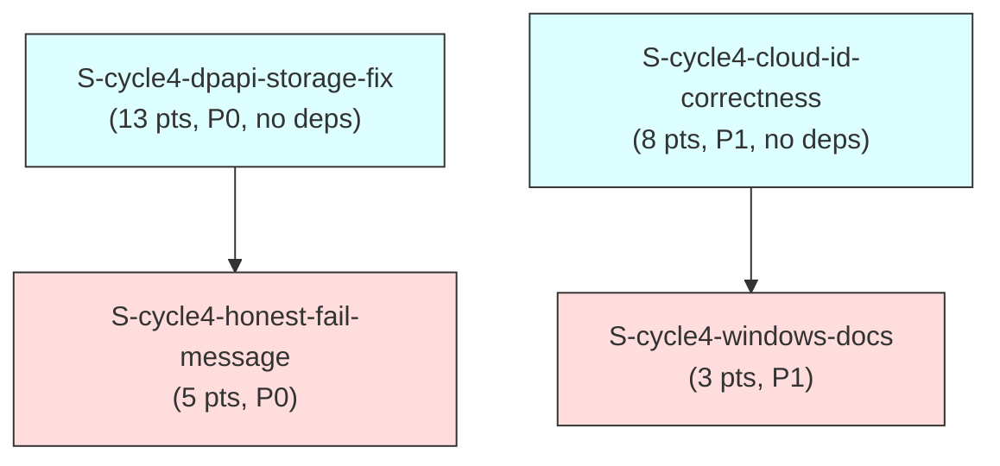

# F3 Extended Dependency Graph — `windows-correctness` (cycle-004)

Computes the dependency graph over the 4 new cycle-004 stories, confirms it is acyclic
(Kahn's algorithm), and cross-links it against the existing `STORY-INDEX.md` graph
(168 stories as of this pass, including the six existing `S-WIN-*` stories from an
earlier Windows-support cycle).

---

## 1. Node Inventory

**Convention note (mirrors cycle-003's dependency-graph-extended.md §1):** `depends_on:`
is the authoritative graph EDGE set; `blocks:` is informational/inverse-consistency-checked
only.

| ID | Story | `depends_on` (frontmatter, verified against story file) |
|----|-------|----------------------------------------------------------|
| A | `S-cycle4-dpapi-storage-fix` | `[]` |
| B | `S-cycle4-cloud-id-correctness` | `[]` |
| C | `S-cycle4-honest-fail-message` | `["S-cycle4-dpapi-storage-fix"]` |
| D | `S-cycle4-windows-docs` | `["S-cycle4-cloud-id-correctness"]` |

**`blocks:` inverse-consistency check:**

| Story | `blocks:` (frontmatter) | Inverse holds? |
|---|---|---|
| A (`dpapi-storage-fix`) | `["S-cycle4-honest-fail-message"]` | C lists A in `depends_on` — consistent |
| B (`cloud-id-correctness`) | `["S-cycle4-windows-docs"]` | D lists B in `depends_on` — consistent |
| C (`honest-fail-message`) | `[]` | consistent — terminal node |
| D (`windows-docs`) | `[]` | consistent — terminal node |

All four `depends_on:`/`blocks:` pairs are symmetric — no over-statement or
under-statement to flag (unlike cycle-003's C-row caveat, which arose from a longer
dependency chain; this cycle's graph is two independent 2-node chains, so there is no
transitive relationship to mischaracterize).

---

## 2. Adjacency List

```
A (dpapi-storage-fix)      -> []                       [no deps]
                                dependents: C
B (cloud-id-correctness)   -> []                       [no deps]
                                dependents: D
C (honest-fail-message)    -> [A]
                                dependents: (none)
D (windows-docs)           -> [B]
                                dependents: (none)
```

**Cross-links to EXISTING stories:** none. All four new stories' `depends_on:`/`blocks:`
arrays reference only other `S-cycle4-*` IDs. Grep-verified: no existing `STORY-INDEX.md`
story references any `S-cycle4-*` ID in its own `depends_on:`/`blocks:` frontmatter, and
none of the four new stories reference an existing story ID as a hard dependency
(including the six `S-WIN-*` stories, whose own scope — per-OS path resolution, the debug
isolation seam, `windows-native` keyring feature presence, CI/release Windows-target
plumbing — is file-disjoint from all four new stories' File Structure Requirements; see
`conflict-report.md` §2 for the explicit per-file check). The cycle-004 subgraph is a
**disjoint set of two independent 2-node chains** relative to the existing story graph.

---

## 3. Visual DAG (Mermaid)



Two independent chains, not one connected component: `A -> C` (compile-time marker-type
dependency) and `B -> D` (content-accuracy dependency) share no edge between them. They
are grouped into the SAME two waves only because both chains happen to have identical
depth (2 layers), not because of any cross-chain dependency.

---

## 4. Cycle Detection — Kahn's Algorithm

### 4a. New-story subgraph (4 nodes)

**In-degree table (initial):**

| Node | In-degree | Incoming from |
|---|---|---|
| A | 0 | — |
| B | 0 | — |
| C | 1 | A |
| D | 1 | B |

**Kahn's algorithm trace:**

| Step | Queue (indegree-0 set) | Node processed | Edges relaxed | Updated in-degrees |
|---|---|---|---|---|
| 1 | {A, B} | A | A→C | C: 1→0 |
| 2 | {B, C} | B | B→D | D: 1→0 |
| 3 | {C, D} | C | (none) | unchanged |
| 4 | {D} | D | (none) | unchanged |

All 4 nodes dequeued and processed; the queue never emptied while nodes remained
unprocessed. **Every node reached in-degree 0 and was removed exactly once.**

**Result: ACYCLIC. CONFIRMED.**

**Topological order** (one valid linearization; A/B tied at step 1, C/D tied after their
respective predecessor clears):

```
1. S-cycle4-dpapi-storage-fix       (A)
2. S-cycle4-cloud-id-correctness    (B)
3. S-cycle4-honest-fail-message     (C)
4. S-cycle4-windows-docs            (D)
```

(A second valid linearization swaps 1/2 and/or 3/4 — both pairs are tied in-degree at
their respective steps. `wave-schedule.md` makes both ties explicit as parallelism.)

### 4b. Combined graph (4 new + 168 existing = 172 nodes)

Same proof shape as cycle-003's dependency-graph-extended.md §4b:

1. **The new 4-node subgraph is acyclic** (proven in §4a — exhaustive Kahn's-algorithm
   trace, every node reaches in-degree 0 and is removed exactly once).
2. **Zero edges cross the boundary** between the new subgraph and the existing graph — no
   `S-cycle4-*` story's `depends_on:`/`blocks:` names an existing story ID, and no
   existing story (168 rows, including the six `S-WIN-*` stories) names an `S-cycle4-*`
   ID (§2).
3. **A cycle can only be introduced by an edge.** Since the new subgraph contributes zero
   edges into or out of the existing graph, the union graph's edge set is the disjoint
   union of the two edge sets. If graph G = G1 ⊔ G2 (disjoint union, no cross-edges) and
   both G1 and G2 are acyclic, G is acyclic (a cycle must lie entirely within one
   weakly-connected component).

**Conclusion: the combined 172-node graph is ACYCLIC**, contingent on the existing
168-story graph's pre-established acyclicity (unchanged by this burst) continuing to
hold.

---

## 5. Summary

- 4 new nodes, 2 directed edges (two independent 2-node chains), 0 cross-links to the
  existing 168-story graph.
- Kahn's algorithm terminates cleanly (all nodes dequeued) — **no cycle**.
- See `wave-schedule.md` for the parallelism-aware grouping of this same graph.

---

## 6. BC Clause Coverage Matrix

**Re-derived from scratch (F3 re-review, 2026-09-04, Finding #2)** — every postcondition
and invariant across ALL 10 new/amended BCs was re-enumerated directly against
`bc-1-auth-identity.md`'s BC bodies (not against the prior pass's matrix), and mapped to
its covering AC, OR an honest non-AC classification where no dedicated runtime AC exists
or is warranted. The prior "corrected" matrix (F3 combined story-review pass) was itself
still non-exhaustive: it omitted BC-1.4.036 Postcondition 1 and Postcondition 4, BC-1.4.036
Invariant 2, BC-1.4.037 Invariant 3, BC-1.4.038 Postcondition 3, BC-1.4.039 Invariants 1-2,
BC-1.4.040 Invariants 1-2, and BC-1.2.053 Invariant 2 — all now added below, either as a
covering-AC row or an explicit classification row. Grouped by BC for readability; "Type"
values use the BC's own postcondition/invariant/edge-case numbering.

| BC | Clause | Type | Covering AC | Story |
|---|---|---|---|---|
| BC-1.2.052 | 1 | postcondition | AC-001 | `S-cycle4-cloud-id-correctness` |
| BC-1.2.052 | 2 | postcondition | AC-002 | `S-cycle4-cloud-id-correctness` |
| BC-1.2.052 | 3 | postcondition | AC-003 | `S-cycle4-cloud-id-correctness` |
| BC-1.2.052 | 4 | postcondition | AC-004 | `S-cycle4-cloud-id-correctness` |
| BC-1.2.052 | 5 | postcondition | AC-005 | `S-cycle4-cloud-id-correctness` |
| BC-1.2.052 | 1-3 | invariant | AC-006 | `S-cycle4-cloud-id-correctness` |
| BC-1.2.053 | 1 | postcondition | AC-007 | `S-cycle4-cloud-id-correctness` |
| BC-1.2.053 | 2 | postcondition | AC-007 | `S-cycle4-cloud-id-correctness` |
| BC-1.2.053 | 1 | invariant | AC-007 | `S-cycle4-cloud-id-correctness` |
| BC-1.2.053 | 2 | invariant | *(see classification below)* | `S-cycle4-cloud-id-correctness` |
| BC-1.2.054 | 1 | postcondition | AC-009 | `S-cycle4-cloud-id-correctness` |
| BC-1.2.054 | 2 | postcondition | AC-009 | `S-cycle4-cloud-id-correctness` |
| BC-1.2.054 | 3 | postcondition | AC-009 | `S-cycle4-cloud-id-correctness` |
| BC-1.2.054 | 1-2 | invariant | AC-009 | `S-cycle4-cloud-id-correctness` |
| BC-1.4.028 (amended) | 1-5 | amended behavior items | AC-010 | `S-cycle4-dpapi-storage-fix` |
| BC-1.4.035 | 1 | postcondition | AC-001 | `S-cycle4-dpapi-storage-fix` |
| BC-1.4.035 | 2 | postcondition | AC-002 | `S-cycle4-dpapi-storage-fix` |
| BC-1.4.035 | 3 | postcondition | AC-003 | `S-cycle4-dpapi-storage-fix` |
| BC-1.4.035 | 4 | postcondition | AC-004 | `S-cycle4-dpapi-storage-fix` |
| BC-1.4.035 | 5 | postcondition | AC-019 | `S-cycle4-dpapi-storage-fix` |
| BC-1.4.035 | 6 | postcondition | AC-005, AC-006 | `S-cycle4-dpapi-storage-fix` |
| BC-1.4.035 | 1 | invariant | AC-005, AC-006 | `S-cycle4-dpapi-storage-fix` |
| BC-1.4.035 | 2 | invariant | AC-001-004 | `S-cycle4-dpapi-storage-fix` |
| BC-1.4.035 | 3 | invariant | AC-007, AC-008 | `S-cycle4-dpapi-storage-fix` |
| BC-1.4.036 | 1 | postcondition | *(see classification below)* | `S-cycle4-dpapi-storage-fix` |
| BC-1.4.036 | 2 | postcondition | AC-009, AC-010 | `S-cycle4-dpapi-storage-fix` |
| BC-1.4.036 | 3 | postcondition | AC-010 | `S-cycle4-dpapi-storage-fix` |
| BC-1.4.036 | 4 | postcondition | AC-007 | `S-cycle4-dpapi-storage-fix` |
| BC-1.4.036 | 5 | postcondition | AC-011 | `S-cycle4-dpapi-storage-fix` |
| BC-1.4.036 | 1, 3 | invariant | AC-010 | `S-cycle4-dpapi-storage-fix` |
| BC-1.4.036 | 2 | invariant | AC-009 | `S-cycle4-dpapi-storage-fix` |
| BC-1.4.037 | 1, 2 | postcondition | AC-012 | `S-cycle4-dpapi-storage-fix` |
| BC-1.4.037 | 3 | postcondition | AC-013 | `S-cycle4-dpapi-storage-fix` |
| BC-1.4.037 | 4 | postcondition | AC-014 | `S-cycle4-dpapi-storage-fix` |
| BC-1.4.037 | 1, 2 | invariant | AC-012, AC-014 | `S-cycle4-dpapi-storage-fix` |
| BC-1.4.037 | 3 | invariant | AC-020 | `S-cycle4-dpapi-storage-fix` |
| BC-1.4.038 | 1, 2, 4 | postcondition | AC-015, AC-016 | `S-cycle4-dpapi-storage-fix` |
| BC-1.4.038 | 3 | postcondition | AC-015 | `S-cycle4-dpapi-storage-fix` |
| BC-1.4.038 | 1, 2, 3 | invariant | AC-015, AC-016 | `S-cycle4-dpapi-storage-fix` |
| BC-1.4.039 | 1 (`ProfilePathEscape` bullet) | postcondition | AC-001 | `S-cycle4-honest-fail-message` |
| BC-1.4.039 | 1 (Site 1 `Some(_)`) | postcondition | AC-002 | `S-cycle4-honest-fail-message` |
| BC-1.4.039 | 1 (Site 3 `Some(_)`) | postcondition | AC-003 | `S-cycle4-honest-fail-message` |
| BC-1.4.039 | 1 (`None`) | postcondition | AC-004 | `S-cycle4-honest-fail-message` |
| BC-1.4.039 | 2, 3 | postcondition | AC-006 | `S-cycle4-honest-fail-message` |
| BC-1.4.039 | 4 | postcondition | AC-005 | `S-cycle4-honest-fail-message` |
| BC-1.4.039 | 1 | invariant | *(see classification below)* | `S-cycle4-honest-fail-message` |
| BC-1.4.039 | 2 | invariant | *(see classification below)* | `S-cycle4-honest-fail-message` |
| BC-1.4.039 | 3 | invariant | AC-007 | `S-cycle4-honest-fail-message` |
| BC-1.4.039 | 4 | invariant | AC-001, AC-005 | `S-cycle4-honest-fail-message` |
| BC-1.4.040 | 1-6 | postcondition | AC-017 | `S-cycle4-dpapi-storage-fix` |
| BC-1.4.040 | 7 | postcondition | AC-017 | `S-cycle4-dpapi-storage-fix` |
| BC-1.4.040 | 8 | postcondition | AC-018 | `S-cycle4-dpapi-storage-fix` |
| BC-1.4.040 | 1 | invariant | *(see classification below)* | `S-cycle4-dpapi-storage-fix` |
| BC-1.4.040 | 2 | invariant | *(see classification below)* | `S-cycle4-dpapi-storage-fix` |
| BC-1.4.040 | 3 | invariant | AC-017 | `S-cycle4-dpapi-storage-fix` |

### 6a. Non-AC Clause Classifications (F3 re-review, 2026-09-04, Finding #2)

The clauses below have no dedicated covering AC. Each is classified explicitly rather than
silently omitted, per the "Task-covered/build-invariant, not a runtime AC" /
"descriptive, not independently testable" / "doc-only" disposition options:

| BC | Clause | Type | Classification | Rationale |
|---|---|---|---|---|
| BC-1.4.036 | 1 | postcondition | **Regression-pinned, not a new AC** | "Both namespaced keyring keys present → return them (fast path, unchanged, all platforms)" is PRE-EXISTING, unchanged behavior — Task 19 ("run `load_oauth_tokens`'s FULL existing pre-cycle-004 test suite byte-for-byte green as an explicit gate on this story's PR") is the enforcement mechanism, not a new acceptance criterion, since this cycle introduces no new behavior for this clause. |
| BC-1.2.053 | 2 (invariant) | invariant | **Confirmed-unchanged, pre-existing BC (BC-1.5.038), not this story's code** | "This BC's guarantee applies symmetrically to an api_token→oauth switch too, insofar as `login_oauth`'s existing `accessible_resources` discovery (BC-1.5.038, unchanged) already refreshes `cloud_id` unconditionally" — explicitly describes UNMODIFIED, pre-existing `login_oauth` behavior this story does not touch (BC-1.5.038 is out of this cycle's BC set). No AC is warranted because there is no new code path to assert against. |
| BC-1.4.037 | 3 (invariant) | invariant | **AC added this pass — AC-020** | See §6 above; was Task/Architecture-Compliance-Rule-covered only prior to this fix (F3 re-review Finding #2), now closed with a dedicated, testable manifest source-text assertion. |
| BC-1.4.039 | 1 (invariant) | invariant | **Descriptive/compound, established by the union of postcondition-tracing ACs** | "The honest-fail message is reachable ONLY when BOTH keyring AND the DPAPI store have failed for a given write... this is now a true edge case" — this is a consequence of BC-1.4.035's routing design (covered by that BC's own ACs) plus this BC's own Postcondition 1/AC-002/003 (the `Some(_)` arms only fire when `DpapiFallbackFailed` is produced), not an independently testable NEW property at this BC. No dedicated AC is warranted; AC-001-004/AC-006/AC-007 collectively establish it. |
| BC-1.4.039 | 2 (invariant) | invariant | **Descriptive/compound, established by the union of postcondition-tracing ACs** | "Every 'Unlock your keychain' message site is accurate for the failure it actually reports, post this BC" restates Postcondition 1's `None`-arm behavior (AC-004) combined with the `Some(_)`-arm behavior (AC-002/003) — it is the compound claim that ACs 002-004 collectively prove, not a separate testable assertion of its own. |
| BC-1.4.040 | 1 (invariant) | invariant | **Descriptive/scope statement, not independently testable** | "This guard is a DEFENSE-IN-DEPTH addition specific to the new secret-file artifact... it does NOT retroactively change `cache_dir(profile)`'s existing (unsanitized) behavior" — a scope-boundary statement about what this BC does NOT do (an absence-of-change claim about a DIFFERENT, unmodified function), not a positive behavioral assertion this story's code produces. Confirmable by code review (no diff touches `cache_dir`), not by a dedicated AC. |
| BC-1.4.040 | 2 (invariant) | invariant | **Descriptive/rationale statement, not independently testable** | "Profile names remain operator-controlled local configuration, not remote-attacker-controlled input — this is a hardening measure... not a response to a demonstrated remote-exploitation vector" is a THREAT-MODEL framing statement (further reinforced by the Pass-20 gate-audit defense-in-depth reclassification this story's BC table row already cites), not a functional behavior to assert against. |

**Requalified completeness claim (supersedes the prior pass's "zero gaps / every
postcondition is covered" claim, which was itself still incomplete):** every postcondition
and invariant across the 10 new/amended BCs is now either (a) covered by at least one AC
in §6's table, or (b) explicitly classified in §6a as regression-pinned, confirmed-unchanged
pre-existing behavior, or a descriptive/non-testable scope statement. No clause is silently
omitted. Zero Gap Register entries are needed (§8) — every §6a classification is a
"this clause needs no AC" disposition, not a "this clause is uncovered" gap.

---

## 7. Edge Case Coverage Matrix

**Scope note, corrected (F3 round-3 re-review, 2026-09-04, Finding #1) — read before using
this table.** The row-level table below lists a REPRESENTATIVE selection of each BC's edge
cases — specifically, the ones the owning story's own Edge Cases table promotes to a
dedicated row — NOT the full `EC-<BC>-N` enumeration `bc-1-auth-identity.md` defines for
each BC. This is a materially WEAKER completeness guarantee than §6/§6a's clause-level
exhaustiveness (a direct, exhaustive re-derivation against BC source text): it is
representative-by-selection here, not enumerated. §7a immediately below states the full
per-BC EC count against what is listed here, and shows that every EC — listed in this
table or not — is covered TRANSITIVELY: each EC in `bc-1-auth-identity.md` is a documented
boundary/exceptional instance of a postcondition or invariant that §6's exhaustive BC
Clause Coverage Matrix already traces to a covering AC (or an explicit §6a non-AC
classification), so the AC that covers that clause exercises the EC's scenario in
substance even where the EC was not independently promoted to its own dedicated
story-level test row. §8 states this two-tier distinction explicitly rather than folding
EC coverage into the same "exhaustively verified" claim made for postconditions/invariants.

| Source | EC ID | Description | Story | AC/EC Reference |
|--------|-------|-------------|-------|----------------|
| BC-1.4.035 | EC-1.4.035-2 | Refresh token shrinks below keyring ceiling after rotation | `S-cycle4-dpapi-storage-fix` | Edge Cases table |
| BC-1.4.036 | EC-1.4.036-1 | DPAPI file created under a different Windows user account | `S-cycle4-dpapi-storage-fix` | Edge Cases table |
| BC-1.4.036 | EC-1.4.036-2 | Namespaced-partial keyring state AND a valid DPAPI file coexist | `S-cycle4-dpapi-storage-fix` | Edge Cases table |
| BC-1.4.037 | EC-1.4.037-2 | Disk full / secrets dir not writable during temp-write | `S-cycle4-dpapi-storage-fix` | Edge Cases table |
| BC-1.4.038 | EC-1.4.038-1 | Pair lives entirely in the DPAPI file | `S-cycle4-dpapi-storage-fix` | Edge Cases table |
| BC-1.4.038 | EC-1.4.038-6 | A DPAPI file exists under a name the CURRENT guard would reject | `S-cycle4-dpapi-storage-fix` | Edge Cases table (documented residual, no test required) |
| BC-1.4.040 | EC-1.4.040-7 | Reserved device-name stem with trailing extension | `S-cycle4-dpapi-storage-fix` | Edge Cases table |
| BC-1.4.040 | EC-1.4.040-10 | Leading-space-prefixed reserved stem | `S-cycle4-dpapi-storage-fix` | Edge Cases table |
| BC-1.4.039 | EC-1.4.039-1 through -5 | Message-selection edge cases | `S-cycle4-honest-fail-message` | Edge Cases table |
| BC-1.2.052 | EC-1.2.052-1 through -5 | Fetch/override edge cases | `S-cycle4-cloud-id-correctness` | Edge Cases table |
| BC-1.2.053 | EC-1.2.053-1, -2 | Mechanism-switch edge cases | `S-cycle4-cloud-id-correctness` | Edge Cases table |
| BC-1.2.054 | EC-1.2.054-3 | Assets gateway acceptance conditional, not guaranteed | `S-cycle4-cloud-id-correctness` | Edge Cases table |
| #760 (doc-only) | EC-760-1 through -4 | Documentation-fix edge cases | `S-cycle4-windows-docs` | Edge Cases table |

No entries from `error-taxonomy.md` are newly introduced by this cycle beyond the
`ProfilePathEscape`-driven row already recorded there (F2 amendment, 2026-09-04) — that
row is covered by `S-cycle4-dpapi-storage-fix`'s AC-017/AC-018 (guard) and
`S-cycle4-honest-fail-message`'s AC-001 (rendering at Sites 1/3).

### 7a. Full EC-Range → Transitive AC Coverage (per BC) (F3 round-3 re-review, 2026-09-04, Finding #1)

Re-derived directly against `bc-1-auth-identity.md`'s own `EC-<BC>-N` lists (not against
the row-level table above) to state, honestly, how many of each BC's edge cases are
individually listed in §7 versus how many exist in total, and which AC(s) — already
established as exhaustive for postconditions/invariants in §6 — transitively cover the
full range regardless of whether a given EC got its own row above.

| BC | Full EC range (per `bc-1-auth-identity.md`) | Total ECs | Listed in §7 above | Covering AC(s) (from §6) | Covering story |
|---|---|---|---|---|---|
| BC-1.2.052 | EC-1.2.052-1 .. -5 | 5 | 5 — exhaustive | AC-001–AC-006 | `S-cycle4-cloud-id-correctness` |
| BC-1.2.053 | EC-1.2.053-1 .. -3 | 3 | 2 (-1, -2; -3 not individually listed) | AC-007 | `S-cycle4-cloud-id-correctness` |
| BC-1.2.054 | EC-1.2.054-1 .. -3 | 3 | 1 (-3; -1/-2 not individually listed) | AC-009 | `S-cycle4-cloud-id-correctness` |
| BC-1.4.035 | EC-1.4.035-1 .. -4 | 4 | 1 (-2; -1/-3/-4 not individually listed) | AC-001–AC-008, AC-019 | `S-cycle4-dpapi-storage-fix` |
| BC-1.4.036 | EC-1.4.036-1 .. -7 | 7 | 2 (-1, -2; -3..-7 not individually listed) | AC-007, AC-009–AC-011 (Postcondition 1's EC territory is regression-pinned, §6a — no new AC) | `S-cycle4-dpapi-storage-fix` |
| BC-1.4.037 | EC-1.4.037-1 .. -3 | 3 | 1 (-2; -1/-3 not individually listed) | AC-012–AC-014, AC-020 | `S-cycle4-dpapi-storage-fix` |
| BC-1.4.038 | EC-1.4.038-1 .. -6 | 6 | 2 (-1, -6; -2..-5 not individually listed) | AC-015, AC-016 | `S-cycle4-dpapi-storage-fix` |
| BC-1.4.039 | EC-1.4.039-1 .. -5 | 5 | 5 — exhaustive | AC-001–AC-007 | `S-cycle4-honest-fail-message` |
| BC-1.4.040 | EC-1.4.040-1 .. -10 | 10 | 2 (-7, -10; -1..-6/-8/-9 not individually listed) | AC-017, AC-018 | `S-cycle4-dpapi-storage-fix` |
| #760 (doc-only) | EC-760-1 .. -4 | 4 | 4 — exhaustive | N/A — doc-only ACs, no BC clause per this cycle's explicit no-BC provision | `S-cycle4-windows-docs` |

**Reading this table (transitive, not independent, coverage):** "Covering AC(s)" is the
union of every AC that appears in §6's BC Clause Coverage Matrix for that BC's
postconditions/invariants. An EC not individually listed in §7's row-level table is still
exercised IN SUBSTANCE by whichever of those ACs' tests covers the postcondition/invariant
the EC illustrates a boundary/exceptional instance of. Concrete example: BC-1.4.040's
EC-1.4.040-1 through -6, -8, and -9 (none individually listed in §7) are each a specific
boundary vector of Postconditions 1-7, which AC-017's single 30-vector parametrized
exhaustive-rejection property test already exercises as one test, not nine separate
dedicated tests naming each EC ID. This is TRANSITIVE coverage: no claim is made that a
dedicated test exists per EC ID; the claim is that the EC's underlying scenario is
exercised by the AC that already covers its parent clause, and that this was verified by
inspection during this pass (walking every EC in the BC body and confirming it maps to an
already-AC-covered postcondition/invariant, not a novel untested behavior). Where an EC's
scenario turned out to describe genuinely different behavior from its parent clause (none
were found in this cycle's 10 BCs), that would be a real Gap Register entry, not a
transitive-coverage claim — see §8.

---

## 8. Gap Register

No entries. **Scope of this "no gaps" claim, corrected (F3 round-3 re-review, 2026-09-04,
Finding #1) — stated as two DIFFERENT completeness strengths, not one blanket claim, since
the prior wording claimed more completeness for edge cases than §7 actually delivered:**

- **BC clauses — postconditions and invariants (§6/§6a): EXHAUSTIVE.** Every postcondition
  and invariant across the 10 new/amended BCs was re-enumerated directly against
  `bc-1-auth-identity.md`'s BC bodies (§6's own header note) and is covered by at least one
  AC (§6) OR carries an explicit non-AC classification (§6a: regression-pinned /
  confirmed-unchanged pre-existing / descriptive non-testable). This is a direct,
  exhaustive re-derivation from BC source text, not an inference from a prior pass's
  matrix — verified in §6/§6a.
- **Edge cases (§7): TRANSITIVE, not independently enumerated — a WEAKER guarantee, stated
  as such.** §7's row-level table lists a representative selection of each BC's
  `EC-<BC>-N` cases (the ones the owning story's Edge Cases table promotes to a dedicated
  row) — it is NOT a claim that a dedicated test exists for every EC ID `bc-1-auth-identity.md`
  defines. §7a states the full EC range per BC (BC-1.4.035: 4, BC-1.4.036: 7, BC-1.4.037: 3,
  BC-1.4.038: 6, BC-1.4.040: 10, BC-1.2.053: 3, BC-1.2.054: 3 — none of these six BCs' full
  EC lists are exhaustively row-listed in §7; BC-1.2.052/BC-1.4.039/#760 ARE exhaustively
  row-listed) and shows every EC in that full range — listed in §7 or not — is covered
  TRANSITIVELY by the AC(s) that §6 already traces to that EC's parent postcondition/
  invariant. No EC was found, during this pass's walk of all ten BCs' full EC lists, to
  describe behavior genuinely divergent from its parent clause's already-AC-covered
  behavior — that is the condition that WOULD make an EC a real gap, distinct from merely
  lacking its own dedicated test row.
- **Error-taxonomy rows: unchanged from the prior pass's finding.** The single new
  `ProfilePathEscape`-driven row is covered by AC-017/AC-018 (guard) and AC-001 (rendering
  at Sites 1/3) — see the paragraph following the §7 table.

`S-cycle4-windows-docs`'s doc-only ACs need no BC-clause coverage per this cycle's explicit
no-BC provision for #760. A §6a classification is a documented "this clause needs no
dedicated AC" disposition, not an unfilled gap — it is listed separately from this Gap
Register precisely because it is not a gap. No Gap Register entry is needed on the EC
layer's weaker (transitive) coverage basis alone — that is a difference in HOW
completeness is established (direct exhaustive re-derivation vs. transitive coverage
through an already-exhaustive clause-level matrix), not a hole in WHAT is covered.

**Correction (F3 re-review, 2026-09-04, Finding #2) — the prior pass's "zero gaps / every
enumerated postcondition is covered" claim was STILL non-exhaustive even after its own
correction below.** A full re-derivation of §6 directly against `bc-1-auth-identity.md`
(not against the prior matrix) found seven further omissions the prior pass's own
"corrected" table did not catch: BC-1.4.036 Postcondition 1 (regression-pinned, §6a),
BC-1.4.036 Postcondition 4 (now traced to AC-007), BC-1.4.036 Invariant 2 (now traced to
AC-009), BC-1.4.037 Invariant 3 (previously Task/Architecture-Compliance-Rule-covered
only — now closed with a dedicated AC-020 in `S-cycle4-dpapi-storage-fix.md`), BC-1.4.038
Postcondition 3 (now traced to AC-015), BC-1.4.039 Invariants 1-2 (descriptive/compound,
§6a), BC-1.4.040 Invariants 1-2 (descriptive, §6a), and BC-1.2.053 Invariant 2
(confirmed-unchanged pre-existing BC-1.5.038 behavior, §6a). This demonstrates the class
of error the dispatching orchestrator flagged: two successive passes each swept one
instance of "matrix claims completeness but a clause was missed" without re-deriving the
matrix from the BC source text itself. This pass's §6/§6a re-derivation was built by
reading every one of the 10 BCs' Postconditions/Invariants sections directly, not by
patching the previously-reported instances alone.

**Correction (F3 combined story-review pass — adversarial + consistency, 2026-09-04,
Finding #1):** the "zero gaps / every enumerated postcondition is covered" claim above was
FALSE as originally written — BC-1.4.035 Postcondition 5 (`auth_windows_store::store_pair`
failing surfaces the `DpapiFallbackFailed` marker error) had NO covering AC in
`S-cycle4-dpapi-storage-fix.md` v1.1: the story's dpapi-storage-write ACs covered only the
SUCCESS path (AC-013/AC-014) and non-Windows non-engagement (AC-007), and Postcondition 5
was documented only as an edge-case row (EC-1.4.037-2), never promoted to an AC. §6's BC
Clause Coverage Matrix now carries the missing row (`BC-1.4.035 | 5 | postcondition |
AC-019 | S-cycle4-dpapi-storage-fix`), added alongside the story's new AC-019 (v1.2). With
that addition, the "zero gaps" claim now holds for the corpus as it stands after this
review pass — it did not hold beforehand, and this note is left in place rather than
silently smoothed over the prior state, per this pipeline's fix-round documentation
convention. See `S-cycle4-dpapi-storage-fix.md`'s AC-019 for the accompanying VP-coverage
observation (no existing VP-AUTHDX-0NN specifically asserts the PRODUCTION path AC-019
covers — flagged for orchestrator in that story and in `decomposition-manifest.md`, not
resolved here since F2 VPs are frozen).
