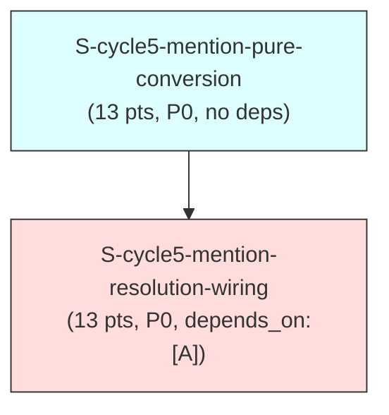

# F3 Extended Dependency Graph — `adf-mentions` (cycle-005, GitHub #674)

Computes the dependency graph over the 2 new cycle-005 stories, confirms it is
acyclic (Kahn's algorithm), and cross-links it against the existing
`STORY-INDEX.md` graph (172 pre-cycle-005 stories; `STORY-INDEX.md`
frontmatter now reads `total_stories: 174` with the 2 new cycle-005 rows
added).

---

## 1. Node Inventory

**Convention note (mirrors cycle-003/cycle-004's dependency-graph-extended.md
§1):** `depends_on:` is the authoritative graph EDGE set; `blocks:` is
informational/inverse-consistency-checked only.

| ID | Story | `depends_on` (frontmatter, verified against story file) |
|----|-------|----------------------------------------------------------|
| A | `S-cycle5-mention-pure-conversion` | `[]` |
| B | `S-cycle5-mention-resolution-wiring` | `["S-cycle5-mention-pure-conversion"]` |

**`blocks:` inverse-consistency check:**

| Story | `blocks:` (frontmatter) | Inverse holds? |
|---|---|---|
| A (`mention-pure-conversion`) | `["S-cycle5-mention-resolution-wiring"]` | B lists A in `depends_on` — consistent |
| B (`mention-resolution-wiring`) | `[]` | consistent — terminal node |

Both `depends_on:`/`blocks:` pairs are symmetric — no over-statement or
under-statement to flag. This is the simplest possible shape: a single 2-node
chain, not the two-independent-chains shape cycle-004's graph had.

---

## 2. Adjacency List

```
A (mention-pure-conversion)       -> []                       [no deps]
                                      dependents: B
B (mention-resolution-wiring)     -> [A]
                                      dependents: (none)
```

**Cross-links to EXISTING stories:** none. Both new stories' `depends_on:`/
`blocks:` arrays reference only `S-cycle5-*` IDs. Grep-verified: no existing
`STORY-INDEX.md` story references any `S-cycle5-*` ID in its own
`depends_on:`/`blocks:` frontmatter, and neither new story references an
existing story ID as a hard dependency. `src/adf.rs` (Story A's target module)
has been modified by nine prior feature cycles (#470-#571), but none of those
completed, merged stories carry a forward-looking `blocks:` edge into this
cycle's stories — the file-level history is relevant context (Story A's own
Previous-work citations), not a graph edge. The cycle-005 subgraph is a
**single, disjoint 2-node chain** relative to the existing story graph.

---

## 3. Visual DAG (Mermaid)



One connected component, one edge: `A -> B` (compile-time dependency — Story
B's resolver and all four wiring call sites call Story A's public `adf.rs`
API and cannot compile without it).

---

## 4. Cycle Detection — Kahn's Algorithm

### 4a. New-story subgraph (2 nodes)

**In-degree table (initial):**

| Node | In-degree | Incoming from |
|---|---|---|
| A | 0 | — |
| B | 1 | A |

**Kahn's algorithm trace:**

| Step | Queue (indegree-0 set) | Node processed | Edges relaxed | Updated in-degrees |
|---|---|---|---|---|
| 1 | {A} | A | A→B | B: 1→0 |
| 2 | {B} | B | (none) | unchanged |

Both nodes dequeued and processed; the queue never emptied while nodes
remained unprocessed. **Every node reached in-degree 0 and was removed exactly
once.**

**Result: ACYCLIC. CONFIRMED.**

**Topological order** (the only valid linearization — no ties, since B strictly
depends on A):

```
1. S-cycle5-mention-pure-conversion       (A)
2. S-cycle5-mention-resolution-wiring     (B)
```

### 4b. Combined graph (2 new + 172 existing = 174 nodes)

Same proof shape as cycle-003/cycle-004's dependency-graph-extended.md §4b:

1. **The new 2-node subgraph is acyclic** (proven in §4a — exhaustive Kahn's-
   algorithm trace, every node reaches in-degree 0 and is removed exactly once).
2. **Zero edges cross the boundary** between the new subgraph and the existing
   graph — no `S-cycle5-*` story's `depends_on:`/`blocks:` names an existing
   story ID, and no existing story (172 rows) names an `S-cycle5-*` ID (§2).
3. **A cycle can only be introduced by an edge.** Since the new subgraph
   contributes zero edges into or out of the existing graph, the union graph's
   edge set is the disjoint union of the two edge sets. If graph G = G1 ⊔ G2
   (disjoint union, no cross-edges) and both G1 and G2 are acyclic, G is
   acyclic (a cycle must lie entirely within one weakly-connected component).

**Conclusion: the combined 174-node graph is ACYCLIC**, contingent on the
existing 172-story graph's pre-established acyclicity (unchanged by this
burst) continuing to hold.

---

## 5. Summary

- 2 new nodes, 1 directed edge (a single linear chain), 0 cross-links to the
  existing 172-story graph.
- Kahn's algorithm terminates cleanly (both nodes dequeued) — **no cycle**.
- See `wave-schedule.md` for the wave grouping of this same graph (2 waves, no
  parallelism within the cycle — B strictly follows A).

---

## 6. BC Clause Coverage Matrix

Re-derived directly against `bc-7-output-render.md`, `cross-cutting.md`, and
`bc-3-issue-write.md`'s own BC bodies for the 13 in-scope BCs (12 new + BC-7.2.004
amended) this cycle introduces or amends. Grouped by BC.

| BC | Clause | Type | Covering AC | Story |
|---|---|---|---|---|
| BC-7.2.016 | 1,5 (bracket emission) | postcondition | AC-001 | `S-cycle5-mention-pure-conversion` |
| BC-7.2.016 | 2,3 (boundary/skip) | postcondition | AC-002 | `S-cycle5-mention-pure-conversion` |
| BC-7.2.016 | 6 (two pure entrypoints) | postcondition | AC-003 | `S-cycle5-mention-pure-conversion` |
| BC-7.2.016 | 7 (`--no-mentions` pure bypass) | postcondition | AC-004 | `S-cycle5-mention-pure-conversion` |
| BC-7.2.016 | 8,9 (depth guard, INV-1) | invariant | AC-010 | `S-cycle5-mention-pure-conversion` |
| BC-7.2.016 | 10 (pass order, code-only skip) | postcondition | AC-008, AC-009 | `S-cycle5-mention-pure-conversion` |
| BC-7.2.016 | 6 [F4 IMPL DETAIL, key-space non-collision] | non-testable design note | AC-014 | `S-cycle5-mention-pure-conversion` |
| BC-7.2.016 | 7 (`--no-mentions` WIRING half — CLI flag declaration + call-site plumbing; F-M-02 cross-ref) | postcondition | AC-014, AC-015 | `S-cycle5-mention-resolution-wiring` |
| BC-7.2.017 | 1,2,3 (attrs.text population) | postcondition | AC-005 | `S-cycle5-mention-pure-conversion` |
| BC-7.2.017 | [control-char sanitization] | invariant | AC-005 | `S-cycle5-mention-pure-conversion` |
| BC-7.2.018 | 1,2,3,4 (`@Name` grammar) | postcondition | AC-006 | `S-cycle5-mention-pure-conversion` |
| BC-7.2.018 | 5 (depth/purity) | postcondition | AC-010 | `S-cycle5-mention-pure-conversion` |
| BC-7.2.018 | 6 (`\@` escape) | postcondition | AC-007 | `S-cycle5-mention-pure-conversion` |
| BC-7.2.019 | 1,2,3 (three-way render) | postcondition | AC-011 | `S-cycle5-mention-pure-conversion` |
| BC-7.2.019 | [no-panic, no-recursion] | invariant | AC-013 | `S-cycle5-mention-pure-conversion` |
| BC-7.2.004 (amended) | [narrowed drop-set] | postcondition | AC-012 | `S-cycle5-mention-pure-conversion` |
| BC-X.7.007 | 1,2,3 (active filter, name-match filter, disambiguate call) | postcondition | AC-002 | `S-cycle5-mention-resolution-wiring` |
| BC-X.7.007 | [behavioral contract table — 4 outcomes] | postcondition | AC-003 | `S-cycle5-mention-resolution-wiring` |
| BC-X.7.007 | [dedup] | edge case | AC-001 | `S-cycle5-mention-resolution-wiring` |
| BC-X.7.008 | 1,2,3 (ambiguous taxonomy) | postcondition | AC-004 | `S-cycle5-mention-resolution-wiring` |
| BC-X.7.009 | 1,2 (zero-match hard error, 3-way message) | postcondition | AC-005 | `S-cycle5-mention-resolution-wiring` |
| BC-X.7.009 | 3 (zero-POST) | postcondition | AC-007 | `S-cycle5-mention-resolution-wiring` |
| BC-X.7.010 | 1,2,3,4 (dedup, validate, hard-error, attrs.text feed) | postcondition | AC-006 | `S-cycle5-mention-resolution-wiring` |
| BC-X.7.010 | 5 (zero-POST) | postcondition | AC-007 | `S-cycle5-mention-resolution-wiring` |
| BC-3.3.012 | 1,2,3,4 | behavior | AC-008 | `S-cycle5-mention-resolution-wiring` |
| BC-3.4.032 | 1,2,3,4 | behavior | AC-009 | `S-cycle5-mention-resolution-wiring` |
| BC-3.4.032 | 5 (dry-run forced non-interactive) | behavior | AC-010 | `S-cycle5-mention-resolution-wiring` |
| BC-3.5.013 | 1,2,3 | behavior | AC-011 | `S-cycle5-mention-resolution-wiring` |
| BC-3.5.013 | 4 (visibility orthogonality) | behavior | AC-012 | `S-cycle5-mention-resolution-wiring` |
| BC-3.8.018 | 1,2,3,4 | behavior | AC-013 | `S-cycle5-mention-resolution-wiring` |
| BC-3.8.018 | 5 (visibility orthogonality parity) | behavior | documented caveat, not AC-validated (delivery is Jira's domain; H-NEW-MENTION-008 does not assert delivery) — now cross-referenced explicitly in AC-013's own trace line (F3 adversarial pass-2, L-1), mirroring AC-012's treatment of BC-3.5.013's parallel clause | `S-cycle5-mention-resolution-wiring` |

**Completeness statement:** every postcondition/behavior clause across the 13
in-scope BCs (12 new + BC-7.2.004 amended) this cycle introduces or amends is
traced to a covering AC in one of the two stories above. No Gap Register entry
is required — see §8.

---

## 7. Edge Case Coverage Matrix

| Source | EC ID | Description | Story | AC/EC Reference |
|--------|-------|-------------|-------|----------------|
| BC-7.2.016 | EC-7.2.016-1 through -7 | Bracket-form boundary/malformed/code-skip/link-inclusion/mark-composition-deferred/reference-collision/`--no-mentions` | `S-cycle5-mention-pure-conversion` | Edge Cases table |
| BC-7.2.017 | EC-7.2.017-1,-2,-4,-5 | Plain display name → `"@Jane Doe"`; unvalidated bracket-form caller omits `attrs.text` entirely; leading-`@`-prefixed display name (`"@build-bot"`) does not double up; pathological control characters in `display_name` sanitized before use | `S-cycle5-mention-pure-conversion` | Edge Cases table; AC-005 |
| BC-7.2.017 | EC-7.2.017-3 | `@Name` form always has `attrs.text` when resolved — an atomicity guarantee: Story B's resolver populates `account_id`+`display_name` together in one `MentionResolutions` entry (never `id`-only for a resolved `@Name`), which Story A's AC-005 emitter then relies on when deciding whether to omit `attrs.text` | `S-cycle5-mention-pure-conversion` (consuming half, AC-005) / `S-cycle5-mention-resolution-wiring` (producing half, AC-001/AC-002) | Edge Cases table (Story A, cross-referenced); cross-story split, same pattern as EC-7.2.018-3/-4 below |
| BC-7.2.018 | EC-7.2.018-1,-2,-5,-8,-9,-10 | `@Name` email/npm-scope/trailing-trim/`\@`-escape/trim-to-empty/adjacent-mentions | `S-cycle5-mention-pure-conversion` | Edge Cases table |
| BC-7.2.018 | EC-7.2.018-3 | Java annotation (`@Override`) in prose is a genuine detection-grammar candidate — a detection-layer negative (whether it hard-errors or resolves is a resolution-layer concern) | `S-cycle5-mention-pure-conversion` | Edge Cases table (detection-layer half); resolution-layer consequence is `S-cycle5-mention-resolution-wiring`'s EC-X.7.009-1 |
| BC-7.2.018 | EC-7.2.018-4 | Slack `@channel`/`@here` broadcast tokens match the grammar as candidates — a detection-layer negative (zero-match hard-error is a resolution-layer concern) | `S-cycle5-mention-pure-conversion` | Edge Cases table (detection-layer half); resolution-layer consequence is `S-cycle5-mention-resolution-wiring`'s EC-X.7.009-3 |
| BC-7.2.018 | EC-7.2.018-6 | `@Name` inside an existing link/code mark — `code`-marked/`codeBlock` excluded, `link`-marked NOT excluded (mirrors EC-7.2.016-4) | `S-cycle5-mention-pure-conversion` | Edge Cases table; AC-009 |
| BC-7.2.018 | EC-7.2.018-7 | Multi-word display name (`@Jane Doe`) — only `@Jane` is captured (single-token grammar); documented non-support, bracket form is the escape hatch | `S-cycle5-mention-pure-conversion` | Edge Cases table; AC-006's single-token grammar |
| BC-7.2.019 | EC-7.2.019-1,-2,-3 | Three-way render: `attrs.text` present renders verbatim (no double `@`); absent-but-`attrs.id`-present falls back to `"@"+id`; neither present renders literal `"@?"` | `S-cycle5-mention-pure-conversion` | Edge Cases table; AC-011 |
| BC-7.2.019 | EC-7.2.019-4,-5 | Empty-string treated as absent; round-trip stability post-fetch only | `S-cycle5-mention-pure-conversion` | Edge Cases table |
| BC-X.7.007 | EC-X.7.007-1,-3,-4,-5 | Dedup, deactivated-only, bot/app accounts, fuzzy-non-match tightening | `S-cycle5-mention-resolution-wiring` | Edge Cases table |
| BC-X.7.007 | EC-X.7.007-2 | Case-insensitive exact match (`MatchResult::Exact`) is reached only when 2+ name-matching active results survive `filter_by_name_match` — a lone surviving result is now GUARANTEED to already be a name match (short-circuits before `partial_match` runs at all) | `S-cycle5-mention-resolution-wiring` | Edge Cases table; AC-003 |
| BC-X.7.008 | EC-X.7.008-1 | Ambiguous error surfaces before HTTP mutation | `S-cycle5-mention-resolution-wiring` | Edge Cases table |
| BC-X.7.008 | EC-X.7.008-2 | Ambiguous `@Name` disambiguation reuses BC-X.7.004's exact stderr wording verbatim — no new message strings introduced for the mention call site | `S-cycle5-mention-resolution-wiring` | Edge Cases table; AC-004 |
| BC-X.7.009 | EC-X.7.009-1,-2,-3 | Java annotation, npm scope, Slack broadcast hard-fail | `S-cycle5-mention-resolution-wiring` | Edge Cases table |
| BC-X.7.009 | EC-X.7.009-4 | Deactivated-only match hits `disambiguate_user`'s empty-list branch (not `MatchResult::None`), hard error carrying the "deactivated" hint — same underlying scenario as BC-X.7.007's EC-X.7.007-3 (already combined into one Story B Edge Cases table row) | `S-cycle5-mention-resolution-wiring` | Edge Cases table (combined with EC-X.7.007-3 row); AC-005 |
| BC-X.7.010 | EC-X.7.010-1,-2,-3 | Malformed/stale id, multiple distinct ids, non-404 HTTP propagation | `S-cycle5-mention-resolution-wiring` | Edge Cases table |
| BC-3.3.012 | EC-3.3.012-1,-2,-3 | No tokens, `--no-mentions` no-op, mixed success/failure | `S-cycle5-mention-resolution-wiring` | Edge Cases table |
| BC-3.4.032 | EC-3.4.032-1,-2,-3 | Dry-run raw-tree preview, no tokens, single-value description semantics | `S-cycle5-mention-resolution-wiring` | Edge Cases table |
| BC-3.5.013 | EC-3.5.013-1,-2,-3 | `no_input` param plumbing, no tokens, JSM restricted-visibility non-error | `S-cycle5-mention-resolution-wiring` | Edge Cases table |
| BC-3.8.018 | EC-3.8.018-1,-2,-3 | `build()` stays synchronous, no tokens, guard-ordering | `S-cycle5-mention-resolution-wiring` | Edge Cases table |

**Coverage note:** unlike cycle-004's dependency-graph-extended.md §7/§7a (which
distinguished a "row-level representative selection" from a "full EC-range" for
its 10 BCs), this cycle's F2 PRD-delta bodies are compact enough that every
edge case each BC's own body defines IS individually listed above — this is a
direct, exhaustive per-BC EC enumeration, not a transitive-coverage claim.
**Correction (F3 adversarial pass-2, M-2):** the prior version of this table
listed only EC-7.2.018-1,-2,-5,-8,-9,-10 for BC-7.2.018 and asserted
exhaustiveness while actually omitting EC-7.2.018-3, -4, -6, and -7 — a false
exhaustiveness claim. All four are now added as rows above (re-derived directly
against `bc-7-output-render.md`'s BC-7.2.018 body, which defines exactly
EC-7.2.018-1 through -10): -3/-4 are detection-layer negatives on Story A's
grammar (the Java-annotation/Slack-broadcast cases are genuine candidates at
detection time; their zero-match hard-error consequence is Story B's
resolution-layer concern, cross-referenced above), -6 is the link/code-skip
rule already covered by Story A's AC-009, and -7 is the multi-word-display-name
non-support already implied by Story A's AC-006 single-token grammar. With
these four rows added, BC-7.2.018's EC-7.2.018-1 through -10 enumeration is now
genuinely complete (10 of 10) and the exhaustiveness claim above holds without
correction going forward.
**Correction (F3 adversarial pass-3, MED) — the pass-2 fix above was itself a
partial-fix regression: it made the exhaustiveness claim genuinely true for
BC-7.2.018 alone and did NOT sweep the same completeness check to every
sibling in-scope BC, so the blanket "every edge case each BC's own body
defines IS individually listed above" sentence was still false as a whole.**
A full per-BC recount against the BC bodies in `bc-7-output-render.md` and
`cross-cutting.md` (the two sources with any remaining gap; `bc-3-issue-write.md`'s
four BCs — BC-3.3.012/BC-3.4.032/BC-3.5.013/BC-3.8.018 — were already complete,
3/3 ECs each, and needed no change) found three more BCs under-enumerated: (1)
**BC-7.2.017 had NO row at all** despite defining EC-7.2.017-1 through -5 in its
body — all five are now added above (as two rows: EC-7.2.017-1,-2,-4,-5 covering
Story A's AC-005 emitter behavior directly, and EC-7.2.017-3 as a cross-story
split — the atomicity guarantee that a resolved `@Name` always carries both
`account_id` and `display_name` together is produced by Story B's resolver
(AC-001/AC-002) and consumed by Story A's AC-005, the identical split pattern
already used for EC-7.2.018-3/-4 above); (2) **BC-7.2.019 listed only
EC-7.2.019-4,-5 of its five**, silently dropping the three-way-render cases
EC-7.2.019-1/-2/-3 — now added as their own row, tracing to Story A's AC-011
(the same AC these three cases directly test); (3) **BC-X.7.007/BC-X.7.008/
BC-X.7.009 each dropped exactly one EC** — EC-X.7.007-2 (case-insensitive
exact-match scope, now traced to AC-003), EC-X.7.008-2 (verbatim wording reuse,
now traced to AC-004), and EC-X.7.009-4 (deactivated-only empty-list branch,
now traced to AC-005 and cross-referenced to its already-combined Story B table
row with EC-X.7.007-3) — all three now added above. Every in-scope BC's
per-BC EC count in this table now matches its body count exactly (verified
table follows this note); both story files' own Edge Cases tables were updated
in the same pass to mirror these additions (pure-side ECs — BC-7.2.017,
BC-7.2.019 — into Story A's table; effectful-side ECs — BC-X.7.007-2,
BC-X.7.008-2 — into Story B's table). With this sweep, the exhaustiveness
claim above now genuinely holds for ALL twelve in-scope BCs this cycle
introduces or amends, not merely the one BC pass-2 happened to fix.

**Per-BC EC completeness verification (body count vs. this table's count, this pass):**

| BC | ECs in body | ECs in this table | Match? |
|---|---|---|---|
| BC-7.2.016 | 7 (EC-1..7) | 7 | Yes |
| BC-7.2.017 | 5 (EC-1..5) | 5 | Yes (was 0 before this pass) |
| BC-7.2.018 | 10 (EC-1..10) | 10 | Yes (fixed pass-2, unchanged this pass) |
| BC-7.2.019 | 5 (EC-1..5) | 5 | Yes (was 2 before this pass) |
| BC-7.2.004 (amended) | 0 (no ECs defined) | 0 (no row) | Yes — nothing to enumerate |
| BC-X.7.007 | 5 (EC-1..5) | 5 | Yes (was 4 before this pass) |
| BC-X.7.008 | 2 (EC-1..2) | 2 | Yes (was 1 before this pass) |
| BC-X.7.009 | 4 (EC-1..4) | 4 | Yes (was 3 before this pass) |
| BC-X.7.010 | 3 (EC-1..3) | 3 | Yes |
| BC-3.3.012 | 3 (EC-1..3) | 3 | Yes |
| BC-3.4.032 | 3 (EC-1..3) | 3 | Yes |
| BC-3.5.013 | 3 (EC-1..3) | 3 | Yes |
| BC-3.8.018 | 3 (EC-1..3) | 3 | Yes |

**Correction (F3 adversarial pass-4, MED) — this §7 matrix's per-BC EC COUNT
was already correct as of pass-3 (the table above), but the "AC/EC Reference"
column's claim of WHERE each EC lives was not: for 7 effectful-side ECs this
column cited "Edge Cases table" when the cited row did not actually exist in
`S-cycle5-mention-resolution-wiring.md`'s (Story B's) own Edge Cases table —
EC-X.7.010-3, EC-3.3.012-1, EC-3.3.012-2, EC-3.4.032-2, EC-3.4.032-3,
EC-3.5.013-2, EC-3.8.018-2. Pass-3's "both story EC tables mirror §7" framing
(the closing sentence of the note above this correction) was therefore true
only for the specific ECs pass-3 itself had just added (EC-7.2.017/EC-7.2.019
into Story A; EC-X.7.007-2/EC-X.7.008-2 into Story B) — it did not hold as a
general claim across every row already citing "Edge Cases table." All 7
underlying behaviors were always AC-covered (most are the degenerate "no
mention tokens present" case, where an empty candidate set means nothing to
resolve — covered by the same wiring AC that covers the non-degenerate path),
so this was a doc-precision defect, not a coverage gap. **Fix:** the 7 rows
are now added to Story B's Edge Cases table verbatim (each with its covering
AC cited inline), which makes every "Edge Cases table" citation below,
including for these 7 ECs, literally true — no citation text needed to
change. See §7a below for the full, both-directions, three-surface
reconciliation this correction is verified against.

---

## 7a. Per-BC Three-Surface EC Reconciliation (F3 pass-4, definitive)

Closes the recurring EC-mirror partial-fix class (pass-2: BC-7.2.018 alone;
pass-3: pure-side ECs + BC-X.7.007-2/BC-X.7.008-2; pass-4: this table) by
checking, for EVERY one of the 13 in-scope BCs, all three surfaces — (1) the
EC count actually defined in the BC's own body, (2) the EC count this
document's §7 lists against that BC, (3) the EC count present as an actual row
in the OWNING story's Edge Cases table (Story A for the five `bc-7-output-render.md`
BCs, Story B for the eight `cross-cutting.md`/`bc-3-issue-write.md` BCs) — and
separately confirming no surface contains a phantom EC (an ID that does not
exist in the BC's own body). Re-derived by direct grep against each BC body
and each table this pass, not inferred from pass-3's table.

| BC | Body EC count | §7 EC count | Owning story | Story table EC count | 3-way match? | Phantoms in any surface? |
|---|---|---|---|---|---|---|
| BC-7.2.016 | 7 (EC-1..7) | 7 (row: "-1 through -7") | Story A | 7 (EC-1..7, all as rows) | Yes | None |
| BC-7.2.017 | 5 (EC-1..5) | 5 (row: "-1,-2,-4,-5" + row: "-3") | Story A | 5 (EC-1,-2,-4,-5 as one row + EC-3 as one row) | Yes | None |
| BC-7.2.018 | 10 (EC-1..10) | 10 (row: "-1,-2,-5,-8,-9,-10" + rows "-3","-4","-6","-7") | Story A | 10 (same 10 IDs, all as rows) | Yes | None |
| BC-7.2.019 | 5 (EC-1..5) | 5 (row: "-1,-2,-3" + row: "-4,-5") | Story A | 5 (EC-1,-2,-3 as one row + EC-4,-5 as one row) | Yes | None |
| BC-7.2.004 (amended) | 0 (no ECs defined) | 0 (no row — correctly nothing to enumerate) | Story A | 0 (no ECs to list) | Yes (vacuous) | None |
| BC-X.7.007 | 5 (EC-1..5) | 5 (row: "-1,-3,-4,-5" + row: "-2") | Story B | 5 (EC-1,-3,-4,-5 as one row + EC-2 as one row) | Yes | None |
| BC-X.7.008 | 2 (EC-1..2) | 2 (row: "-1" + row: "-2") | Story B | 2 (EC-1 as one row + EC-2 as one row) | Yes | None |
| BC-X.7.009 | 4 (EC-1..4) | 4 (row: "-1,-2,-3" + row: "-4") | Story B | 4 (EC-1/-2/-3 combined row + EC-4 combined into the EC-X.7.007-3/EC-X.7.009-4 row) | Yes | None |
| BC-X.7.010 | 3 (EC-1..3) | 3 (row: "-1,-2,-3") | Story B | 3 (EC-1, EC-2, **EC-3 — F3 pass-4 addition**, each its own row) | Yes (was 2/3 before this pass) | None |
| BC-3.3.012 | 3 (EC-1..3) | 3 (row: "-1,-2,-3") | Story B | 3 (**EC-1, EC-2 — F3 pass-4 additions** + pre-existing EC-3 row) | Yes (was 1/3 before this pass) | None |
| BC-3.4.032 | 3 (EC-1..3) | 3 (row: "-1,-2,-3") | Story B | 3 (pre-existing EC-1 row + **EC-2, EC-3 — F3 pass-4 additions**) | Yes (was 1/3 before this pass) | None |
| BC-3.5.013 | 3 (EC-1..3) | 3 (row: "-1,-2,-3") | Story B | 3 (pre-existing EC-1, EC-3 rows + **EC-2 — F3 pass-4 addition**) | Yes (was 2/3 before this pass) | None |
| BC-3.8.018 | 3 (EC-1..3) | 3 (row: "-1,-2,-3") | Story B | 3 (pre-existing EC-1, EC-3 rows + **EC-2 — F3 pass-4 addition**) | Yes (was 2/3 before this pass) | None |

**Result: all 13 in-scope BCs now pass the three-surface check — (body EC
count) == (§7 EC count) == (owning story's Edge Cases table EC count), with
zero phantom EC IDs on any surface.** Six BCs (BC-X.7.010, BC-3.3.012,
BC-3.4.032, BC-3.5.013, BC-3.8.018, and transitively the accuracy of §7's
citation for each) required the 7-row fix in this pass; the remaining seven
BCs were already exact matches carried forward unchanged from pass-3.

**§6/§8 "12 new/amended BCs" phrasing note — FIXED (F3 adversarial pass-5,
LOW-3):** §6's intro and completeness statement and §8's Gap Register above
previously described "the 12 new/amended BCs this cycle introduces" — the
actual unique-BC count across both stories is 13 (5 in Story A + 8 in Story B,
since BC-7.2.016 is cross-referenced in Story B's frontmatter but is Story A's
own BC, not an additional one). This table (§7a) correctly enumerated all 13
even while that prose still said "12". Pass-4 flagged the discrepancy as
pre-existing and out of scope for its own EC-mirror fix; pass-5 corrected the
three conflating spots (§6 intro, §6 completeness statement, §8) to "13
in-scope BCs (12 new + BC-7.2.004 amended)", matching §7a's phrasing. This was
always a doc-precision defect, never a coverage gap — every one of the 13 BCs
is, and always was, covered in §6.

**With this table, the closing sentence of §7's per-BC EC completeness note
above ("both story files' own Edge Cases tables were updated in the same pass
to mirror these additions") is now true as a GENERAL claim, not merely for the
specific pass-3 additions it originally described — every EC this document's
§7 cites against a story's "Edge Cases table" genuinely exists as a row in
that story's table, in both directions, for all 13 in-scope BCs.**

---

## 8. Gap Register

No entries. Every postcondition/behavior clause across the 13 in-scope BCs
(12 new + BC-7.2.004 amended) (§6) is covered by at least one AC, and every edge case each BC defines is
individually listed in §7 against the covering story. This completeness claim
is a direct re-derivation against the BC/EC source text in
`bc-7-output-render.md`, `cross-cutting.md`, and `bc-3-issue-write.md`, read in
full during story authoring (per each story's own "Source of Truth" section) —
not an inference from a prior pass's matrix.

Two items are explicitly OUT of this Gap Register's scope because they are not
gaps in AC coverage — they are F4-contingent verification items already
flagged and tracked in `verification-delta-674.md` §11 item 0 and cross-cited
in `S-cycle5-mention-pure-conversion.md`'s AC-007 (the `\@` escape mechanism,
VP-674-012) and AC-015 (the mark-composition empirical check, EC-7.2.016-5,
VP-674-005 — **correction (F-H-02): AC-015 is a NEW AC added in this pass; the
prior version of this document cited "Edge Cases table" as VP-674-005's
covering AC, which was FALSE — the Edge Cases table has no `traces to`
mechanism and provided no actual AC coverage, so VP-674-005 was orphaned
(zero covering AC, zero Task) until AC-015/Task 17 were added.** Both
VP-674-012 and VP-674-005 now have a covering AC that explicitly documents the
F4-contingent status and both branches of its possible outcome; neither is a
silent omission. See §9 (new) for the full per-VP coverage matrix that
would have caught this gap mechanically.

---

## 9. VP Coverage Matrix

**Process-gap fix (adversarial pass-1 observation):** this document previously
carried a BC Clause Coverage Matrix (§6) and an Edge Case Coverage Matrix (§7)
but no per-VP matrix — the gap that let VP-674-005 sit in Story A's
`verification_properties` frontmatter with no covering AC and no Task
undetected until adversarial review (F-H-02). Every `VP-674-NNN` referenced in
either story's frontmatter is enumerated below, re-derived directly from each
AC's own `(traces to ...)` line — not inferred from a prior pass.

| VP | Story | Covering AC(s) | BC Source |
|----|-------|-----------------|-----------|
| VP-674-001 | `S-cycle5-mention-pure-conversion` | AC-001 | BC-7.2.016 |
| VP-674-002 | `S-cycle5-mention-pure-conversion` (emitter half) + `S-cycle5-mention-resolution-wiring` (resolution half) | AC-005 (A) / AC-002 (B) | BC-7.2.017 (A) / BC-X.7.007 (B) |
| VP-674-003 | `S-cycle5-mention-resolution-wiring` | AC-004 | BC-X.7.008 |
| VP-674-004 | `S-cycle5-mention-pure-conversion` | AC-003 | BC-7.2.016 |
| VP-674-005 | `S-cycle5-mention-pure-conversion` | AC-015 **(NEW, F-H-02 fix — previously orphaned)** | BC-7.2.016 edge case EC-7.2.016-5 |
| VP-674-006 | `S-cycle5-mention-pure-conversion` | AC-002, AC-008, AC-009, AC-010 | BC-7.2.016 / BC-7.2.018 |
| VP-674-007 | `S-cycle5-mention-pure-conversion` | AC-011, AC-012 | BC-7.2.019 |
| VP-674-008 | `S-cycle5-mention-pure-conversion` | AC-013 | BC-7.2.019 |
| VP-674-009 | `S-cycle5-mention-resolution-wiring` | AC-001, AC-002 | BC-X.7.007 |
| VP-674-010 | `S-cycle5-mention-resolution-wiring` | AC-004, AC-005, AC-007 | BC-X.7.008 / BC-X.7.009 / BC-X.7.010 |
| VP-674-011 | `S-cycle5-mention-resolution-wiring` | AC-012 | BC-3.5.013 |
| VP-674-012 | `S-cycle5-mention-pure-conversion` | AC-007 | BC-7.2.018 |
| VP-674-013 | `S-cycle5-mention-resolution-wiring` | AC-001, AC-006 | BC-X.7.007 / BC-X.7.010 |
| VP-674-014 | `S-cycle5-mention-resolution-wiring` | AC-008, AC-017 | BC-3.3.012 |
| VP-674-015 | `S-cycle5-mention-resolution-wiring` | AC-009, AC-017 | BC-3.4.032 |
| VP-674-016 | `S-cycle5-mention-resolution-wiring` | AC-011, AC-017 | BC-3.5.013 |
| VP-674-017 | `S-cycle5-mention-resolution-wiring` | AC-013, AC-017 | BC-3.8.018 |
| VP-674-018 | `S-cycle5-mention-pure-conversion` | AC-006 | BC-7.2.018 |
| VP-674-019 | `S-cycle5-mention-pure-conversion` (part a) + `S-cycle5-mention-resolution-wiring` (part b) | AC-004 (A) / AC-008, AC-011, AC-013, AC-014, AC-015 (B) | BC-7.2.016 (A) / BC-3.3.012, BC-3.4.032, BC-3.5.013, BC-3.8.018 (B) |
| VP-674-020 | `S-cycle5-mention-resolution-wiring` | AC-010 | BC-3.4.032 |
| VP-674-021 | `S-cycle5-mention-resolution-wiring` | AC-002, AC-003, AC-005 | BC-X.7.007 |

**Completeness statement:** every `VP-674-NNN` listed in either story's
`verification_properties` frontmatter array (10 in Story A, 13 in Story B, one
shared — VP-674-002 — and one split across both — VP-674-019) has at least one
covering AC in the table above. Zero orphaned VPs remain as of this pass.
