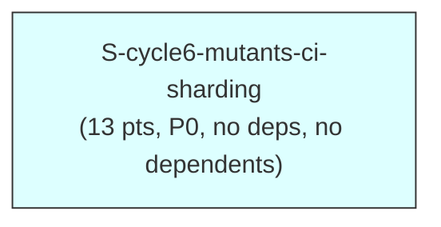

# F3 Extended Dependency Graph — `mutants-ci-sharding` (cycle-006)

Computes the dependency graph over the 1 new cycle-006 story, confirms it
is acyclic (Kahn's algorithm — trivially, for a single node), and
cross-links it against the existing `STORY-INDEX.md` graph (174
pre-cycle-006 stories after cycle-005's 2 rows were added; `STORY-INDEX.md`
frontmatter reads `total_stories: 174` as of this session — this document
does not itself edit that file; state-manager registers the new row per
this story's own return-summary instructions).

---

## 1. Node Inventory

**Convention note (mirrors cycle-003/cycle-004/cycle-005's dependency-
graph-extended.md §1):** `depends_on:` is the authoritative graph EDGE
set; `blocks:` is informational/inverse-consistency-checked only.

| ID | Story | `depends_on` (frontmatter, verified against story file) |
|----|-------|----------------------------------------------------------|
| A | `S-cycle6-mutants-ci-sharding` | `[]` |

**`blocks:` inverse-consistency check:**

| Story | `blocks:` (frontmatter) | Inverse holds? |
|---|---|---|
| A (`mutants-ci-sharding`) | `[]` | consistent — trivially, the only node in this cycle, no other cycle-006 story exists to block |

No inconsistency to flag — a single-node subgraph has no internal edges by
construction.

---

## 2. Adjacency List

```
A (mutants-ci-sharding) -> []     [no deps, no dependents within this cycle]
```

**Cross-links to EXISTING stories:** none. `S-cycle6-mutants-ci-sharding`'s
`depends_on:`/`blocks:` arrays are both `[]`. Grep-verified: no existing
`STORY-INDEX.md` story references `S-cycle6-mutants-ci-sharding` in its
own `depends_on:`/`blocks:` frontmatter (no such ID existed before this
burst), and this new story references no existing story ID as a hard
dependency. The cycle-006 subgraph is a **single, disjoint 1-node
component** relative to the existing 174-story graph.

**Non-graph cross-cycle relationship (explicitly NOT an edge — see Story
Task 1):** this story's Task 1 records that PR #778 (a cycle-005 artifact,
`S-cycle5-mention-pure-conversion`'s Wave 1 delivery) must resolve against
the OLD single-job `mutants` gate BEFORE this story's `ci.yml` changes
land, and that cycle-006 is intended to land to `develop` BEFORE PR #778
rebases onto the new sharded gate (per `STATE.md`'s recorded sequencing,
DEC-348). This is a **process/scheduling relationship between two
DIFFERENT cycles' artifacts**, not a story-to-story dependency-graph
edge: cycle-005 is PAUSED (its own graph is a separate, already-acyclic
2-node chain, `S-cycle5-mention-pure-conversion` -> `S-cycle5-mention-
resolution-wiring`, proven in `cycle-005/phase-f3-stories/dependency-
graph-extended.md`), and PR #778 is a delivered artifact of a story in
that cycle, not itself a story node in THIS cycle's graph. Encoding it as
a `depends_on:`/`blocks:` edge would be a category error (a story cannot
depend on a pull request), so it is recorded here, in the story's own
Task list, and in `STATE.md`'s Concurrent Cycles section as a
scheduling/sequencing note — never as a graph edge.

---

## 3. Visual DAG (Mermaid)



One connected component, zero edges. The simplest possible shape: a
single isolated node.

---

## 4. Cycle Detection — Kahn's Algorithm

### 4a. New-story subgraph (1 node)

**In-degree table (initial):**

| Node | In-degree | Incoming from |
|---|---|---|
| A | 0 | — |

**Kahn's algorithm trace:**

| Step | Queue (indegree-0 set) | Node processed | Edges relaxed | Updated in-degrees |
|---|---|---|---|---|
| 1 | {A} | A | (none — A has no outgoing edges) | unchanged |

The single node is dequeued and processed on the first step; the queue
never emptied while nodes remained unprocessed (there is only one node,
and it reached in-degree 0 immediately since it started there).

**Result: ACYCLIC. CONFIRMED** (trivially — a 1-node, 0-edge graph cannot
contain a cycle by definition, but the Kahn trace is still run and
recorded here for consistency with every prior cycle's dependency-graph
document, per this story-writer's own "Rules: Dependency graph must be
acyclic (validate with topological sort)" obligation).

**Topological order** (the only valid linearization):

```
1. S-cycle6-mutants-ci-sharding   (A)
```

### 4b. Combined graph (1 new + 174 existing = 175 nodes)

Same proof shape as cycle-003/cycle-004/cycle-005's dependency-graph-
extended.md §4b:

1. **The new 1-node subgraph is acyclic** (proven trivially in §4a — a
   single node with zero edges cannot form a cycle).
2. **Zero edges cross the boundary** between the new subgraph and the
   existing graph — `S-cycle6-mutants-ci-sharding`'s `depends_on:`/
   `blocks:` are both `[]` (§2), and no existing story (174 rows) names
   `S-cycle6-mutants-ci-sharding` in its own `depends_on:`/`blocks:`.
3. **A cycle can only be introduced by an edge.** Since the new subgraph
   contributes zero edges into or out of the existing graph, the union
   graph's edge set is the disjoint union of the two edge sets. If graph
   G = G1 ⊔ G2 (disjoint union, no cross-edges) and both G1 and G2 are
   acyclic, G is acyclic (a cycle must lie entirely within one
   weakly-connected component).

**Conclusion: the combined 175-node graph is ACYCLIC**, contingent on the
existing 174-story graph's pre-established acyclicity (unchanged by this
burst) continuing to hold.

---

## 5. Summary

- 1 new node, 0 directed edges, 0 cross-links to the existing 174-story
  graph.
- No intra-cycle wave sequencing needed — see `wave-schedule.md` (a
  single Wave 1 containing the sole story).
- The PR #778 sequencing relationship is process-level, recorded in the
  story's own Task 1 and in `STATE.md`, never as a graph edge (§2 above).

## BC Clause Coverage Matrix

**N/A — governance is policy-doc-only for this cycle (DEC-348/DEC-349, no
new PRD BC).** There are no BC clauses to enumerate a coverage matrix
against. The equivalent traceability artifact for this cycle is the
Invariant/VP Coverage Matrix below.

## Edge Case Coverage Matrix

| Source | EC ID | Description | Story | AC Reference |
|--------|-------|--------------|-------|----------------|
| INV-COMPLETE Part C (crash) | EC-001 | All 8 shards crash under `continue-on-error` | S-cycle6-mutants-ci-sharding | AC-006 |
| INV-COMPLETE Part C (empty) | EC-002 | Legitimately-empty shard slices | S-cycle6-mutants-ci-sharding | AC-007 |
| INV-COMPLETE Part B | EC-003 | Missing shard sentinel | S-cycle6-mutants-ci-sharding | AC-002 |
| INV-COMPLETE Part B | EC-004 | Duplicate shard sentinel/artifact | S-cycle6-mutants-ci-sharding | AC-002 |
| INV-AGG sub-invariant 8 | EC-005 | Under-count reconciliation mismatch | S-cycle6-mutants-ci-sharding | AC-008 |
| INV-AGG sub-invariant 8 | EC-006 | Over-count reconciliation mismatch | S-cycle6-mutants-ci-sharding | AC-022 |
| INV-AGG sub-invariant 3 | EC-007 | Malformed per-shard `outcomes.json` | S-cycle6-mutants-ci-sharding | AC-001 (VP-MUTANTS-SHARD-001 backs the pooled-summation step this per-file guard protects; sub-invariant 3 itself is a carried-forward sub-case from the single-job `Check kill rate` step, per Architecture Compliance Rules — no dedicated new AC, unlike the two sharding-INTRODUCED Part C arms below, EC-017/EC-018, which have no single-job predecessor and get their own AC-036/AC-037) |
| INV-ESCALATE Step 0 | EC-008 | Empty/unrecognized `EVENT_NAME` | S-cycle6-mutants-ci-sharding | AC-014 |
| INV-ESCALATE | EC-009 | >120 in-diff mutants | S-cycle6-mutants-ci-sharding | AC-003 |
| F-H1 (round-8) | EC-010 | `STATUS_DIR`/`SHARD_DIR` redirect attack | S-cycle6-mutants-ci-sharding | AC-026, AC-027 |
| LOW-1 (round-9) | EC-011 | `MUTANT_COUNT`/`OVERALL_DIFF_LINES`/`PLAN_RESULT` hardcode attack | S-cycle6-mutants-ci-sharding | AC-028, AC-029, AC-030 |
| M2-i analog | EC-012 | `run:` line neutering (`\|\| true`, etc.) | S-cycle6-mutants-ci-sharding | AC-017 |
| M2-q analog (round-16 node-property class) | EC-013 | YAML anchor/tag key-smuggling | S-cycle6-mutants-ci-sharding | AC-020 |
| §6.11 jq-shim vector | EC-014 | `$GITHUB_PATH`-prepended `jq` shim | S-cycle6-mutants-ci-sharding | AC-024, AC-025 |
| mutants-sharding-invariants.md round-6 empirical premise | EC-015 | `--list`<->pooled reconciliation premise unverified | S-cycle6-mutants-ci-sharding | AC-035 (F4 Blocking Precondition 3) |
| verification-delta.md §5A | EC-016 | Common-mode `mutants-diff-file` corruption | S-cycle6-mutants-ci-sharding | Documented residual, explicitly out of scope (see story's Edge Cases table + Out of Scope section) |
| INV-COMPLETE Part C (fold-wins, sharding-INTRODUCED) | EC-017 | `run_outcome != success` but `has_outcomes == true` with a valid `outcomes.json` | S-cycle6-mutants-ci-sharding | AC-036 |
| INV-COMPLETE Part C (sentinel/data desync, sharding-INTRODUCED) | EC-018 | `has_outcomes == true` but `outcomes.json` absent or fails `jq empty` | S-cycle6-mutants-ci-sharding | AC-037 |
| INV-ESCALATE Residual Risk 5 (diagnostics short-circuit, Step 0.5) | EC-019 | `mutants-plan` itself fails outright (`PLAN_RESULT != "success"`) before any shard sentinel is inspected | S-cycle6-mutants-ci-sharding | AC-038 |
| INV-COMPLETE § "Removed: the old count-based branch" (base-ref-drift, Step 5) | EC-020 | `total_scored==0` (already reconciled to `MUTANT_COUNT==0` at Step 4) and `OVERALL_DIFF_LINES==0` | S-cycle6-mutants-ci-sharding | AC-039 |

## Invariant/VP Coverage Matrix (BC-analog for this policy-doc-only cycle)

**Bucketing corrected to match the AUTHORITATIVE VP allocation
(`verification-delta.md` § VP-MUTANTS-SHARD-013/014/015 rows + the
story's own Behavioral Contracts
table, `S-cycle6-mutants-ci-sharding.md`): VP-013/VP-014/VP-015 are
peer-parity WIRING pins (consumer-side wiring guard / fail-closed event
guard / structural wiring pin respectively) — none of the three is an
INV-AGG or INV-ESCALATE member. They are bucketed under the fourth,
"structural/runtime peer-parity" row below, alongside every other
non-invariant-named VP (VP-004, VP-005, VP-009 through VP-021, VP-024
through VP-030) — this is the same four-row bucketing the story's own
Behavioral Contracts table already uses; this matrix previously
disagreed with it.**

| Invariant | Stories | Full Coverage? |
|-----------|---------|-----------------|
| INV-AGG | S-cycle6-mutants-ci-sharding | Yes — AC-001, AC-008, AC-022, AC-023 (sub-invariant 8 both directions covered; sub-invariants 1-7 carried forward verbatim from `Check kill rate`, no dedicated new AC needed per Architecture Compliance Rules) |
| INV-COMPLETE | S-cycle6-mutants-ci-sharding | Yes — AC-002 (Part B); Part C's four arms: harness-crash (AC-006), legitimately-empty (AC-007), `has_outcomes`-wins FOLD (AC-036, sharding-INTRODUCED, no single-job predecessor), and sentinel/data desync (AC-037, sharding-INTRODUCED, no single-job predecessor); plus the base-ref-drift FAIL/OK decision (AC-039, `§ "Removed: the old count-based branch"`, sharding-INTRODUCED — the pre-sharding single-job design's own base-ref-drift signal was count-based and was deleted outright, not carried forward, per that same section) |
| INV-ESCALATE | S-cycle6-mutants-ci-sharding | Yes — AC-003 (the sole INV-ESCALATE-proper VP, VP-MUTANTS-SHARD-003) plus AC-038 (Step 0.5's diagnostics short-circuit, INV-ESCALATE Residual Risk 5 — no dedicated VP, rides the aggregator `--self-test` fixture floor); VP-014 is INV-ESCALATE-*adjacent* per its own verification-delta.md row, and VP-015 is a structural wiring-integrity pin — both bucketed in the peer-parity row below, not here |
| (structural/runtime peer-parity, no dedicated invariant name — §6.8/§6.11, mirrors the story's own Behavioral Contracts table) | S-cycle6-mutants-ci-sharding | Yes — AC-004, AC-005, AC-009 through AC-021, AC-024 through AC-030 (covers VP-004, VP-005, VP-009 through VP-021, VP-024 through VP-030 — includes VP-013/014/015 correctly bucketed here, not under INV-AGG/INV-ESCALATE above) |

## VP to Stories Matrix

| VP-MUTANTS-SHARD-NNN | Story | Invariant Source |
|---|---|---|
| 001 | S-cycle6-mutants-ci-sharding | INV-AGG |
| 002 | S-cycle6-mutants-ci-sharding | INV-COMPLETE Part B |
| 003 | S-cycle6-mutants-ci-sharding | INV-ESCALATE |
| 004 | S-cycle6-mutants-ci-sharding | structural pin |
| 005 | S-cycle6-mutants-ci-sharding | structural pin |
| 006 | S-cycle6-mutants-ci-sharding | INV-COMPLETE Part C (crash) |
| 007 | S-cycle6-mutants-ci-sharding | INV-COMPLETE Part C (empty) |
| 008 | S-cycle6-mutants-ci-sharding | INV-AGG sub-invariant 8 |
| 009 | S-cycle6-mutants-ci-sharding | structural cross-check |
| 010 | S-cycle6-mutants-ci-sharding | structural pin |
| 011 | S-cycle6-mutants-ci-sharding | three-way empty-consistency |
| 012 | S-cycle6-mutants-ci-sharding | self-test |
| 013 | S-cycle6-mutants-ci-sharding | consumer-side wiring guard |
| 014 | S-cycle6-mutants-ci-sharding | fail-closed event guard |
| 015 | S-cycle6-mutants-ci-sharding | structural wiring pin |
| 016 | S-cycle6-mutants-ci-sharding | structural extraction-wiring pin |
| 017 | S-cycle6-mutants-ci-sharding | structural anti-neutering (M2-i analog) |
| 018 | S-cycle6-mutants-ci-sharding | structural anti-neutering (M2-o analog) |
| 019 | S-cycle6-mutants-ci-sharding | structural invocation assertion |
| 020 | S-cycle6-mutants-ci-sharding | structural node-property scan |
| 021 | S-cycle6-mutants-ci-sharding | structural per-step `if:`-VALUE pin |
| 022 | S-cycle6-mutants-ci-sharding | INV-AGG sub-invariant 8 (over-count) |
| 023 | S-cycle6-mutants-ci-sharding | INV-AGG sub-invariant 8 (completeness-over-quality) |
| 024 | S-cycle6-mutants-ci-sharding | runtime-hardening parity (source wiring) |
| 025 | S-cycle6-mutants-ci-sharding | runtime-hardening parity (no bare jq) |
| 026 | S-cycle6-mutants-ci-sharding | evidence-source integrity (`STATUS_DIR`) |
| 027 | S-cycle6-mutants-ci-sharding | evidence-source integrity (`SHARD_DIR`) |
| 028 | S-cycle6-mutants-ci-sharding | env-wiring integrity (`MUTANT_COUNT`) |
| 029 | S-cycle6-mutants-ci-sharding | env-wiring integrity (`OVERALL_DIFF_LINES`) |
| 030 | S-cycle6-mutants-ci-sharding | env-wiring integrity (`PLAN_RESULT`) |

All 30 VPs map to the single story — full coverage, no gaps, no
justified-omission rows needed.

## Gap Register

**No gaps.** All 30 VPs are covered by this story's ACs (1:1, AC-001
through AC-030 map to VP-MUTANTS-SHARD-001 through -030 respectively);
the 9 non-VP-numbered ACs (031-035, 036-039) cover the fixed-denominator
counters, the `ci-gate.needs` retarget, the shard invocation shape, the
nightly workflow isolation, F4 Blocking Precondition 3's empirical gate,
INV-COMPLETE Part C's two sharding-INTRODUCED arms (AC-036 the
`has_outcomes`-wins FOLD rule and AC-037 the sentinel/data-desync
fail-closed check, added Pass-4 MED-1), Step 0.5's `PLAN_RESULT`
diagnostic short-circuit (AC-038, INV-ESCALATE Residual Risk 5, added
Phase F3 round 5's systematic aggregator-step audit), and Step 5's
base-ref-drift FAIL/OK decision (AC-039, INV-COMPLETE's "Removed: the
old count-based branch" section, added the same round-5 audit) — all
structural/process/sharding-introduced obligations named explicitly in
`architecture-delta.md`/`mutants-sharding-invariants.md`/`ci-yml-
design.md` with no VP number assigned to them by F2's own VP-ID
allocation (`0. VP-ID allocation`, `verification-delta.md`), so their
absence from the VP list is a design choice already made at F2, not a
gap this document introduces. The round-5 audit's full step-by-step
accounting (confirming Step -1 through Step 6 of `ci-yml-design.md §3`'s
`evaluate_mutants_aggregate()` each have either a dedicated AC or an
explicit carried-forward/rides-AC-001 disposition) lives in the story's
own "Aggregator Step -> AC/Task Coverage Audit" section.
The one explicitly accepted, out-of-scope residual (§5A common-mode
`mutants-diff-file` corruption, EC-016 above) is NOT a gap — it is a
documented, F2-human-approved (DEC-349) residual with its own accepted-risk
justification (backstopped by the nightly full run) and is recorded as
such in the story's Edge Cases table and Out of Scope section, not
entered here as an unjustified omission.
