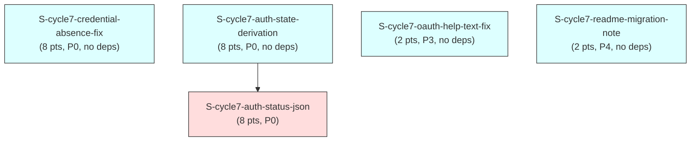

# F3 Extended Dependency Graph — `auth-correctness-dx` (cycle-007)

Computes the dependency graph over the 5 new cycle-007 stories, confirms it is
acyclic (Kahn's algorithm), and cross-links it against the existing
`STORY-INDEX.md` graph (175 pre-cycle-007 stories; `STORY-INDEX.md`
frontmatter reads `total_stories: 175` as of this session — this document does
not itself edit that file; state-manager registers the new rows per this F3
burst's own return-summary instructions).

---

## 1. Node Inventory

**Convention note (mirrors cycle-003/004/005/006's dependency-graph-
extended.md §1):** `depends_on:` is the authoritative graph EDGE set;
`blocks:` is informational/inverse-consistency-checked only.

| ID | Story | `depends_on` (frontmatter, verified against story file) |
|----|-------|-----------------------------------------------------------|
| A | `S-cycle7-credential-absence-fix` | `[]` |
| B1 | `S-cycle7-auth-state-derivation` | `[]` |
| B2 | `S-cycle7-auth-status-json` | `["S-cycle7-auth-state-derivation"]` |
| C | `S-cycle7-oauth-help-text-fix` | `[]` |
| D | `S-cycle7-readme-migration-note` | `[]` |

**`blocks:` inverse-consistency check:**

| Story | `blocks:` (frontmatter) | Inverse holds? |
|-------|---------------------------|-----------------|
| A (`credential-absence-fix`) | `[]` | consistent — no story names A in its own `depends_on:` |
| B1 (`auth-state-derivation`) | `["S-cycle7-auth-status-json"]` | consistent — B2's `depends_on:` names B1 |
| B2 (`auth-status-json`) | `[]` | consistent — nothing depends on B2 |
| C (`oauth-help-text-fix`) | `[]` | consistent |
| D (`readme-migration-note`) | `[]` | consistent — D's `depends_on:` is deliberately `[]` (see D's own frontmatter `origin:` for the rejected-edge reasoning: the `--profile` flag already works today independent of Story A's status, so the PRD delta's "sequence after A" recommendation is editorial, not a build-order requirement) |

No inconsistency to flag.

---

## 2. Adjacency List

```
A (credential-absence-fix)    -> []                          [no deps, no dependents within this cycle]
B1 (auth-state-derivation)    -> [B2]                         [no deps; blocks B2]
B2 (auth-status-json)         -> []   depends_on: [B1]        [1 dep; no dependents]
C (oauth-help-text-fix)       -> []                          [no deps, no dependents]
D (readme-migration-note)     -> []                          [no deps, no dependents (editorial-only sequencing note re: A, not a graph edge)]
```

**Cross-links to EXISTING stories:** none. All 5 new stories' `depends_on:`
arrays reference only each other (B2 -> B1) or are empty. Grep-verified: no
existing `STORY-INDEX.md` story references any `S-cycle7-*` id in its own
`depends_on:`/`blocks:` frontmatter (no such ids existed before this burst),
and none of the 5 new stories references an existing story ID as a hard
dependency. The cycle-007 subgraph is a **disjoint 5-node component**
(2 connected pairs/singletons: `{A}`, `{B1, B2}`, `{C}`, `{D}`) relative to
the existing 175-story graph.

**File-overlap notes (NOT graph edges — see `wave-schedule.md` §2 for the
full accounting):**
- A and B1 both touch `src/api/auth.rs` (A: two isolated error-message
  branches in `load_api_token`; B1: a wholly new `derive_auth_state`
  function elsewhere in the same file) — no line-level overlap expected, but
  flagged as a same-file merge-conflict risk, same pattern as cycle-003's
  Wave 4 (`S-cycle3-adr0011-newtype` + `S-cycle3-oauth-default-creation`,
  no dependency edge, "delivered in the recommended intra-wave order per
  wave-schedule.md §3").
- B1 and B2 plan to edit `.cargo/mutants.toml` `examine_globs`
  (adding `src/cli/auth/list.rs` and `src/cli/auth/status.rs` respectively,
  currently absent from that allowlist entirely — an F3-discovered
  pre-existing gap for a HIGH/MEDIUM-criticality module pair). Treated
  identically to `CHANGELOG.md`: a shared, append-only file. **Ownership
  (F3 adversary pass-3, finding MED-1 — corrects an earlier draft where A
  also proposed adding `list.rs`/`status.rs`, despite touching neither):**
  each file gets exactly ONE owning story, the one that actually modifies
  it. `src/cli/auth/list.rs` is owned exclusively by B1; `src/cli/auth/
  status.rs` is owned exclusively by B2. B1 and B2 additionally append
  their own `exclude_re` entries scoped to the one genuinely keyring-gated
  (no in-memory injection seam) effectful function each story's addition
  newly brings into scope — see `wave-schedule.md` §2's "examine_globs
  ownership" / "exclude_re additions" subsections and each story's own
  "Mutation Testing Scope" section for the full classification and exact
  regex text.
  **`src/api/auth.rs` — DROPPED, deferred (F3 adversary pass-4, finding
  MEDIUM-1, supersedes the pass-3 framing above for this ONE file):** A and
  B1 both modify `src/api/auth.rs` in product code (A: two isolated
  `load_api_token` error branches; B1: the new `derive_auth_state`
  function), and an earlier draft (F3 pass-2/pass-3) had A add this file to
  `examine_globs` with B1 "confirming rather than duplicating." That
  whole-file addition is now REMOVED from both stories: `examine_globs` has
  no sub-file targeting, so adding whole-file `auth.rs` would pull ~15-20
  PRE-EXISTING keyring-gated functions neither story touches (`load_oauth_
  tokens`, `store_*`, `clear_*`, `probe_stored_credential_kind`, etc.) into
  the nightly full-scope mutation run, flooding it with un-actionable false
  survivors just to gain signal for the two functions these stories
  actually change. See `S-cycle7-credential-absence-fix`'s "Deferred:
  `src/api/auth.rs` Mutation-Scope Expansion" section for the full
  rationale and the locked disposition (standing deferred item, not this
  cycle's blocker). Neither story's own correctness proof depends on this
  deferred mutation-testing signal — `derive_auth_state`'s exhaustive
  default-CI truth-table tests (VP-AUTHDX-024/025) and `load_api_token`'s
  keyring-gated exit-code tests stand on their own.

---

## 3. Visual DAG (Mermaid)



One directed edge (`B1 -> B2`); four otherwise-isolated nodes.

---

## 4. Cycle Detection — Kahn's Algorithm

### 4a. New-story subgraph (5 nodes, 1 edge)

**In-degree table (initial):**

| Node | In-degree | Incoming from |
|------|-----------|----------------|
| A | 0 | — |
| B1 | 0 | — |
| B2 | 1 | B1 |
| C | 0 | — |
| D | 0 | — |

**Kahn's algorithm trace:**

| Step | Queue (indegree-0 set) | Node processed | Edges relaxed | Updated in-degrees |
|------|--------------------------|-------------------|------------------|------------------------|
| 1 | {A, B1, C, D} | A (arbitrary order within the set) | (none — A has no outgoing edges) | unchanged |
| 2 | {B1, C, D} | B1 | B1 -> B2 relaxed | B2: 1 -> 0 |
| 3 | {B2, C, D} | B2 | (none — B2 has no outgoing edges) | unchanged |
| 4 | {C, D} | C | (none) | unchanged |
| 5 | {D} | D | (none) | unchanged |

The queue never emptied while nodes remained unprocessed; all 5 nodes were
dequeued and processed.

**Result: ACYCLIC. CONFIRMED.**

**Topological order** (one valid linearization; A/C/D are mutually
interchangeable at their respective queue positions):

```
1. S-cycle7-credential-absence-fix     (A)
2. S-cycle7-auth-state-derivation      (B1)
3. S-cycle7-oauth-help-text-fix        (C)
4. S-cycle7-readme-migration-note      (D)
5. S-cycle7-auth-status-json           (B2)
```

### 4b. Combined graph (5 new + 175 existing = 180 nodes)

Same proof shape as cycle-003/004/005/006's dependency-graph-extended.md §4b:

1. **The new 5-node subgraph is acyclic** (proven in §4a via a completed
   Kahn's-algorithm trace).
2. **Zero edges cross the boundary** between the new subgraph and the
   existing graph — every `S-cycle7-*` story's `depends_on:`/`blocks:` array
   either is `[]` or references only another `S-cycle7-*` id (§2), and no
   existing story (175 rows) names any `S-cycle7-*` id in its own
   `depends_on:`/`blocks:` frontmatter.
3. **A cycle can only be introduced by an edge.** Since the new subgraph
   contributes zero edges into or out of the existing graph, the union
   graph's edge set is the disjoint union of the two edge sets. If graph
   G = G1 ⊔ G2 (disjoint union, no cross-edges) and both G1 and G2 are
   acyclic, G is acyclic (a cycle must lie entirely within one weakly-
   connected component).

**Conclusion: the combined 180-node graph is ACYCLIC**, contingent on the
existing 175-story graph's pre-established acyclicity (unchanged by this
burst) continuing to hold.

---

## 5. Summary

- 5 new nodes, 1 directed edge (`B1 -> B2`), 0 cross-links to the existing
  175-story graph.
- 2 waves needed: Wave 1 (A, B1, C, D — all indegree-0 at round 1), Wave 2
  (B2 — indegree-0 only after B1 completes). See `wave-schedule.md` for the
  full wave plan, including the file-overlap risk note (§2 above) and the
  editorial (non-graph) sequencing recommendation for D relative to A.

## BC Clause Coverage Matrix

| BC | Story | Coverage |
|----|-------|-----------|
| BC-1.4.032 | S-cycle7-credential-absence-fix | Postcondition 2 — AC-001; Invariant 6 — AC-009 (cross-ref) |
| BC-1.4.033 | S-cycle7-credential-absence-fix | Postcondition 2 — AC-002; Invariant 2/SR-009 — AC-005 |
| BC-1.4.034 | S-cycle7-credential-absence-fix | Cross-reference only (H1/Postcondition 1 quote BC-1.4.032 verbatim); F4 doc-fallout obligation — AC-009 |
| BC-1.1.004 | S-cycle7-credential-absence-fix | NEGATIVE pin, unchanged — AC-006, AC-007, AC-008 |
| BC-1.6.048 | S-cycle7-auth-state-derivation (primary); S-cycle7-auth-status-json (cross-ref, text-channel Postcondition 3) | Postconditions 1/2/4 — AC-001..006, AC-010, AC-011 (B1); Postcondition 2 "Preferred implementation shape" (pure-core/effectful-shell split) — AC-014 (B1, F3 adversary pass-1 finding F-1); Postcondition 3 (as revised round 6) — AC-007, AC-008 (B2); B2's own JSON-builder purity confirmation — AC-013 (B2, F-1) |
| BC-1.6.049 | S-cycle7-auth-state-derivation | Postconditions 1-4 — AC-007..010; Postcondition 3 (no color/icon) — AC-013 (NEW, F3 adversary pass-1 finding LOW-1); Invariants 1-2 — AC-009, AC-010 |
| BC-1.6.046 | S-cycle7-auth-state-derivation | Cross-reference (fixture-regen obligation) — AC-012 |
| BC-1.6.050 | S-cycle7-auth-status-json | Postconditions 1-6 — AC-001..006; Invariants 1-2 — AC-011, AC-012; EC-1.6.050-1/2/3/4 — AC-009, AC-010, AC-008 |
| BC-1.6.047 | S-cycle7-auth-status-json | Postcondition 2a — AC-003 (cross-ref, realized not redesigned) |
| BC-1.2.049 | S-cycle7-oauth-help-text-fix | EC-1.2.049-3 — AC-001, AC-002, AC-003 (doc-only, no Postcondition/Invariant change) |

**Full Coverage?** YES for every BC touched by this cycle's F1/F2 scope.
No BC in `cycle-007-prd-delta.md` (new: BC-1.6.048/049/050; amended:
BC-1.4.032/033/034, BC-1.6.047 contingency resolution; light-touch:
BC-1.6.046, BC-1.2.049) is left without at least one covering story AC. The
one deliberately-untouched BC in this cycle's scope, BC-1.1.004, is covered
as a NEGATIVE pin (AC-006/007/008 above), consistent with the PRD delta's
own scope-narrowing decision (§5.1).

## Edge Case Coverage Matrix

| Source | EC ID | Description | Story | AC/EC Reference |
|--------|-------|--------------|-------|-------------------|
| BC-1.4.032 | EC-1.4.032-1 | `"default"` profile, legacy pair present, namespaced absent | S-cycle7-credential-absence-fix | Edge Cases table (regression, unaffected by this story's message-text change beyond the `--profile`/exit-2 amendment already covered by AC-001) |
| BC-1.4.032 | EC-1.4.032-3 | Non-`"default"` profile, no special-casing | S-cycle7-credential-absence-fix | Edge Cases table |
| BC-1.4.032 | EC-1.4.032-4 | User runs corrected remediation once | S-cycle7-credential-absence-fix | Edge Cases table |
| BC-1.4.033 | EC-1.4.033-1 | Namespaced partial-write takes precedence over legacy state | S-cycle7-credential-absence-fix | Edge Cases table |
| BC-1.6.048 | EC-1.6.048-1 | Legacy-flat-pair-only credential -> `no-credentials` | S-cycle7-auth-state-derivation | Edge Cases table |
| BC-1.6.048 | EC-1.6.048-2 | Mismatched credential kind -> `no-credentials` | S-cycle7-auth-state-derivation | AC-005 |
| BC-1.6.048 | EC-1.6.048-3 | Mid-session transition, no caching | S-cycle7-auth-state-derivation | Edge Cases table |
| BC-1.6.048 | EC-1.6.048-4 | Both-kinds-stored, matching kind wins | S-cycle7-auth-state-derivation | AC-006 |
| BC-1.6.049 | EC-1.6.049-1 | Legacy-flat-only -> `no-credentials` | S-cycle7-auth-state-derivation | Edge Cases table |
| BC-1.6.049 | EC-1.6.049-2 | Probe-error scenario retired (OBS-PB-1, unrealizable from locked `bool` caller shape) | S-cycle7-auth-state-derivation | Documented residual, out of scope (see BC-1.6.048 round-4 STATUS note) |
| BC-1.6.049 | EC-1.6.049-3 | Up-to-N OS access prompts, accepted UX cost | S-cycle7-auth-state-derivation | Edge Cases table |
| BC-1.6.049 | EC-1.6.049-4 | Mismatched-kind row renders identically across `list`/`status` | S-cycle7-auth-state-derivation + S-cycle7-auth-status-json (parity completed in B2) | AC-005 (B1); VP-AUTHDX-024 parity (B2) |
| BC-1.6.050 | EC-1.6.050-1 | Unknown profile -> standard error envelope | S-cycle7-auth-status-json (JSON envelope) + S-cycle7-credential-absence-fix (VP-AUTHDX-028 origin) | AC-009 (B2), AC-006/007/008 (A) |
| BC-1.6.050 | EC-1.6.050-2 | Fresh-install zero-profiles, no JSON | S-cycle7-auth-status-json | AC-010 |
| BC-1.6.050 | EC-1.6.050-3 | Backend-error collapse, OBS-PB-1 out of scope | S-cycle7-auth-status-json | Documented residual, out of scope |
| BC-1.6.050 | EC-1.6.050-4 | `url:None` + matching-kind-present divergence | S-cycle7-auth-status-json | AC-008 |
| BC-1.2.049 | EC-1.2.049-1 | `--oauth --output json`, no notice | S-cycle7-oauth-help-text-fix | Edge Cases table |
| BC-1.2.049 | EC-1.2.049-2 | `--oauth`+`--api-token` mutually exclusive | S-cycle7-oauth-help-text-fix | Edge Cases table |
| BC-1.2.049 | EC-1.2.049-3 | Guard rejection precedes deprecation notice | S-cycle7-oauth-help-text-fix | AC-003 |
| PRD delta §6.2 (no BC/EC id — doc-only) | N/A | OAuth-vs-api-token migration asymmetry documented in README | S-cycle7-readme-migration-note | AC-003 |

## NFR to Stories Matrix

| NFR | Stories Implementing It | Validation Method |
|-----|----------------------------|------------------------|
| NFR-O-N (retired by BC-1.6.050's existence) | S-cycle7-auth-status-json | AC-012 (CLAUDE.md gotcha-entry update in the same burst); the separate `nfr-catalog.md` row-text edit is DEFERRED (pre-existing TD-031 stable-anchor debt, unrelated to this cycle's diff, per `cycle-007-prd-delta.md` §7) — NOT this story's blocker, a carried-forward maintenance-sweep task |

## VP to Stories Matrix

| VP-AUTHDX-NNN | Story | BC Source |
|-----------------|-------|--------------|
| 024 | S-cycle7-auth-state-derivation (pure-function half); parity fully realized once S-cycle7-auth-status-json lands | BC-1.6.048 |
| 025 | S-cycle7-auth-state-derivation | BC-1.6.049 |
| 026 | S-cycle7-auth-status-json | BC-1.6.050 |
| 027 | S-cycle7-credential-absence-fix | BC-1.4.032 + BC-1.4.033 |
| 028 | S-cycle7-credential-absence-fix | BC-1.1.004 (negative pin) |
| 029 | S-cycle7-auth-status-json | BC-1.6.048 Postcondition 3 |

All 6 VP-AUTHDX-024..029 ids allocated by the F2 verification-delta are
covered by exactly one primary story each (VP-AUTHDX-024 spans B1+B2, as its
own scope — pure-function proof in B1, full two-machine-channel end-to-end
parity in B2 — already documents).

**VP-AUTHDX-024 frontmatter-vs-coverage note (F3 adversary pass-2, finding
LOW-3):** `S-cycle7-auth-status-json`'s (B2) own `verification_properties:`
frontmatter array deliberately lists only `[VP-AUTHDX-026, VP-AUTHDX-029]`
— it does NOT list VP-AUTHDX-024. This is not an omission: VP-AUTHDX-024's
full end-to-end two-machine-channel parity is an EMERGENT INTEGRATION
property, not a property any single story's own unit/AC-level tests can
assert alone — it requires BOTH `auth list --output json` (B1) AND `auth
status --output json` (B2) to exist and be exercised against the SAME
keychain state in the SAME test session. B2 contributes exactly two
structural pieces toward it — AC-002 (`"status"` computed via the shared
`derive_auth_state` helper, never a second independently-computed value)
and AC-011 (field-name parity with `render_list_json`'s schema) — neither
of which is, on its own, the full parity guarantee. The full runtime proof
lives in `wave-holdout-scenarios.md`'s **H-W2-INT-001**
("`auth list` STATUS and `auth status --output json`'s `"status"` field
NEVER disagree"), a Wave-2 cross-cutting integration scenario that is
explicitly NOT scoped to either story's own frontmatter `verification_properties:`
list — it is a wave-gate artifact, not a story AC. A frontmatter-keyed VP
checker that expects every VP a story's body mentions to also appear in
that story's own `verification_properties:` array should treat
VP-AUTHDX-024 as the documented exception: it is fully closed only at the
Wave 2 gate (via H-W2-INT-001 + B2's AC-002/AC-011 as the structural
half-proofs), not by any single story's frontmatter.

## Gap Register

**No gaps.** Every BC this cycle's F2 pass authored, amended, or
light-touch-annotated (BC-1.6.048/049/050 new; BC-1.4.032/033/034 amended;
BC-1.6.047 contingency resolved; BC-1.6.046, BC-1.2.049 light-touch) is
covered by at least one story AC (BC Clause Coverage Matrix above). Every
edge case the F2 pass added or cross-referenced is covered by at least one
story AC or explicitly documented as an accepted, out-of-scope residual
(OBS-PB-1's two manifestations, EC-1.6.049-2/EC-1.6.050-3 — pre-existing
standing item, not a gap this cycle introduces or is obligated to close).
Every P0/P1 NFR this cycle touches (NFR-O-N) is referenced by at least one
story (NFR to Stories Matrix above). #785 (headless `JR_EMAIL`/`JR_API_TOKEN`
credential resolution) is explicitly OUT OF SCOPE per the human F1-gate
decision — no story, BC, or gap entry exists for it in this cycle by design
(`cycle-007-prd-delta.md`'s own opening scope statement).
