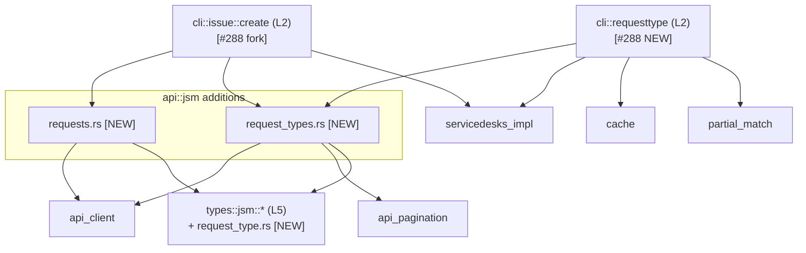

# F2 Architecture Delta — Issue #288

## 1. Files Updated

| File | Action | What Was Added |
|------|--------|----------------|
| `.factory/architecture/adr/0014-jsm-request-create-dispatch-fork.md` | NEW | Full ADR for the dispatch-fork design decision (Option C over Options A and B) |
| `.factory/architecture/adr-index.md` | APPENDED | ADR-0014 row in summary table |
| `.factory/architecture/component-graph.md` | APPENDED | 4 new module nodes (`requests.rs`, `request_types.rs`, `cli::requesttype`, `types::jsm::request_type`); 10 new dependency edges; `Issue #288 Delta — DAG Verification` section |
| `.factory/architecture/system-overview.md` | APPENDED | L2/L4 module counts updated; `JSM Issue Creation Path` section; new cache key in deployment topology; updated network egress row |
| `.factory/architecture/cross-cutting.md` | APPENDED | Section 10 (3 subsections): new cache key family, OAuth scope release coordination flag, dispatch fork cross-cutting invariants |
| `.factory/architecture/risk-register.md` | APPENDED | Issue #288 risk block (R-H288-1, R-M288-1); risk summary counts updated (34 → 36) |

No files were rewritten. All updates are append-or-targeted-edit operations.

---

## 2. ADR Decision

**ADR-0014 was drafted.** Number: 0014. Title: "JSM Request Creation Dispatch Fork in `jr issue create`."

**3-sentence rationale:** The feature required choosing between a separate top-level command (`jr request create`), automatic JSM routing based on project type, or a conditional dispatch fork gated on `--request-type` presence. The separate-command option was rejected because it duplicates the full project/ADF/output-format resolution stack already in `handle_create` and creates UX surface duplication. Automatic routing was rejected because it is a silent behavioral change for existing users creating agent-side issues on JSM projects and requires an additional HTTP round-trip on every `issue create` call; the conditional fork is opt-in, zero-cost when the flag is absent, and preserves the platform path as an unchanged regression baseline.

ADR-0014 is filed at `.factory/architecture/adr/0014-jsm-request-create-dispatch-fork.md`.

---

## 3. Dependency Graph Delta

Text form (all edges are additions; no edges removed; no existing edges modified):

```
ADDED — new L4 modules (api::jsm subgraph expanded):
  api::jsm::requests       → api::client (L3)          [HTTP POST /servicedeskapi/request]
  api::jsm::requests       → types::jsm::* (L5)
  api::jsm::request_types  → api::client (L3)          [HTTP GET /servicedeskapi/servicedesk/{id}/requesttype]
  api::jsm::request_types  → api::pagination (L3)      [isLastPage pagination]
  api::jsm::request_types  → types::jsm::* (L5)
  types::jsm::request_type → serde, std                [pure serde struct]

ADDED — new L2 handler (cli::requesttype):
  cli::requesttype → api::jsm::request_types
  cli::requesttype → api::jsm::servicedesks  [reuses existing, not modified]
  cli::requesttype → cache (L6)
  cli::requesttype → partial_match (L6)

ADDED — modified L2 handler (cli::issue::create, conditional branch only):
  cli::issue::create → api::jsm::requests
  cli::issue::create → api::jsm::request_types
  cli::issue::create → api::jsm::servicedesks  [reuses existing]
```

**Cycle check result: PASS.** All new edges follow L2 → L4 → L3 → L5 → external direction. No upward edges introduced. The existing L4 → L2 prohibition is preserved. DAG remains acyclic.

Mermaid delta (additions only):



---

## 4. Cross-Cutting Notes

### Cache Key Prefix

New cache key family: `v1/<profile>/request_types_<serviceDeskId>.json`

- TTL: 7 days (identical to all other caches)
- Struct: `RequestTypeCache { fetched_at, service_desk_id, request_types: Vec<CachedRequestType> }`
- Pattern: identical to `teams.json` (read_team_cache / write_team_cache)
- Multi-profile invariant preserved: `read_request_type_cache(profile, service_desk_id)` takes both params
- Per-serviceDeskId keying (not per-project) because one profile can have multiple service desks

### OAuth Scope — Release Coordination Flag

`write:servicedesk-request` added to `DEFAULT_OAUTH_SCOPES` constant in `src/api/auth.rs`.

This is the only change in the entire feature that has a release-coordination dependency OUTSIDE the codebase. The scope must be registered in the Atlassian Developer Console for the embedded `jr` OAuth app before any binary that includes S-288-C ships. Failure mode: `invalid_scope` on every new OAuth login and refresh for all users (not just JSM users).

CI cannot detect console-side drift. The pinning test (`default_oauth_scopes_pins_the_full_set_with_offline_access`) detects code-side drift only. Story S-288-C acts as an explicit release-gate blocker for S-288-D; the PR checklist for S-288-D must include manual staging confirmation.

Risk registered as R-H288-1 (HIGH) in risk-register.md §Issue #288 block.

---

## 5. Purity Boundary Statement

All four new modules follow the existing purity classification:

| Module | Boundary Class | Rationale |
|--------|---------------|-----------|
| `src/api/jsm/requests.rs` | Effectful shell (HTTP) | `impl JiraClient` block, identical boundary class to `api/jsm/queues.rs` |
| `src/api/jsm/request_types.rs` | Effectful shell (HTTP) | `impl JiraClient` block with pagination loop |
| `src/types/jsm/request_type.rs` | Pure (no I/O) | Serde structs; depends only on `serde`, `std`; same as all `types/` modules |
| `src/cli/requesttype.rs` | Effectful shell (HTTP + cache + stdin) | L2 handler; same class as `cli/queue.rs` |

The `handle_create` dispatch fork in `src/cli/issue/create.rs` does not change that file's boundary class (already effectful shell). The JSM branch calls effectful functions (`require_service_desk`, `list_request_types`, `create_jsm_request`) — consistent with the existing effectful classification.

Formal verification scope is unchanged: no new pure-core functions are introduced that would warrant proof harnesses. Proptest candidates (noted for F6): `requestFieldValues` map construction from `--field NAME=VALUE` pairs.

---

## 6. Deferred Architecture Work

The following items are noted but deferred beyond F2:

- `handle_create` shard: the file grows by ~120–160 LOC to ~1,760 LOC. ADR-0012 (shard rule) applies at the function level; the new branch is structurally separate. No shard spec triggered by this delta. Revisit at F7 if the file exceeds 2,000 LOC.
- `cli/issue/create.rs` formalization: proptest harness for `requestFieldValues` construction is an F6 item per F1 delta analysis.
- `--type` / `--request-type` interaction warning: implementation detail for F4/S-288-D; F5 adversarial review must verify the warning fires correctly and does not error (which would break existing `--type` automation).
